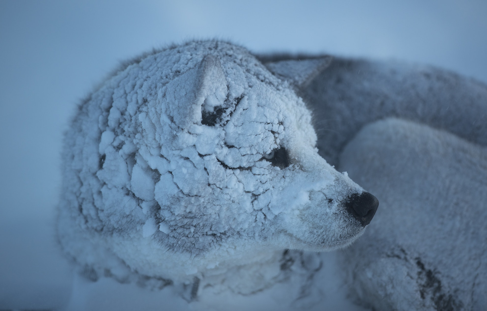

# Introduction {#intro}

All living creatures constantly interact with the environment. To understanding individual animals, we have to understand the relationship they have with their environment. Also, animals affect the environment. From birth to death, an animal generates carbon dioxide, methane, feces, and urine. The excretes from the animal are built with molecules such as carbon, nitrogen, sulfur, and phosphorus, and are recycled within and between ecosystems. 

```{r snow-dog, fig.cap="Alaskan Malamute has the heat-conserving features.", echo = FALSE, out.width = "100%", fig.align='center'}

```

g