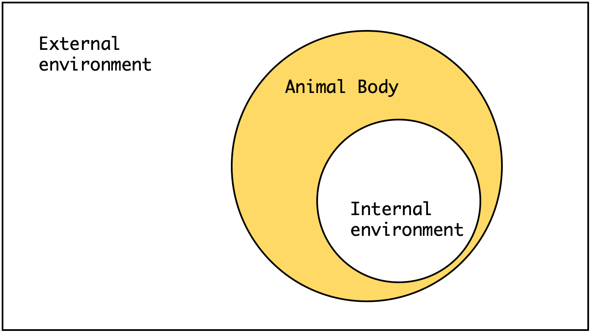

# Animal and environment {#chapter2}
## External environment
Animal never separates from the stimuli from outside. In the domestic animals, the external environment includes both physical (e.g. housing, feeder, paddock, fence, and noise) and biotic (e.g. human, mate, and feed ingredients) components like those of animal habitat \@ref(intro).   

```{r ext-int-env, fig.cap="External and internal environment", echo = FALSE, out.width = "60%", fig.align='center'}

```

## Internal environment
> "The living body, though it has need of the surrounding environment, is nevertheless relatively independent of it." --- Claude Bernard

Higher animals have complex organ systems that respond to stimuli to perform their essential body functions. When the animal receives the signals from the sensory organs, they produce a local reflex action and/or react in the central nervous system. Weak signals produce no responses, but strong stimuli change the physiological or behavioral status of the animal.  

### Shelford's law of tolerance  
> "Each and every species is able to exist and reproduce successfully only within a definite range of environmental conditions." --- Ronald Good

Although external environments are continuously changed, if animals in the normal status, they keep the composition of the extracellular fluid (internal environment) constant to maintain their life. We call it *homeostasis*. 

```{r homeostasis, tab.cap="List of homeostatic control variables", tidy=FALSE, echo=FALSE, message=FALSE}
tibble::tribble(
  ~"Control variables",
  "Core temperature; Blood glucose; Iron levels; Copper regulation; Levels of blood gases;",
  " Blood oxygen content; Arterial blood pressure; Calcium levels; Sodium concentration;",
  "Potassium concentration; Fluid balance; Blood pH; Cerebrospinal fluid; Neurotransmission;",
  " Neuroendocrine system; Gene regulation; and Energy balance"

) %>% knitr::kable(caption = "List of homeostatic control variables", booktabs = TRUE)
```

However, the capacity to maintain the homeostasis is broken when the animals let the harsh environments and differ by their species. **Animals may be limited in their growth and their occurrence by the minimum, maximum, and optimum condition** [@shelford] (Fig. \@ref(fig:law-of-tol)).

```{r law-of-tol, fig.cap="Shelford's law of tolerance", echo=FALSE, message=FALSE, fig.width=6, fig.height=3}
library(ggplot2)
library(ggthemes)

ggplot(data.frame(x = c(-3, 3)), aes(x)) +
  stat_function(fun = dnorm, n = 101, args = list(mean = 0, sd = 1)) +
  scale_y_continuous(breaks = NULL) +
  scale_x_discrete(breaks = NULL) +
  ylab("Growth or Population") +
  xlab("Tolerance level") +
  theme_few()
```

The optimum range of environmental condition may differ within the same organism, and it is not necessarily fixed. They can change as:

  - Change of seasons
  - Change of environmental conditions
  - Life stage of the organism

### Adaptation
> "Changes in morphological, anatomical, physiological, biochemical and behavioral characteristics of the animal which promote welfare and favor survival in a specific environment." --- Hafez  

@hafez1968adaptation defined an adaptation as above. The adaptation helps an animal survive in their external environment. The representative adaptive traits are:

  1. Structural adaptation
  2. Behavioral adaptation
  3. Physiological adaptation

Structural adaptation is the changes in physical features (e.g. body shape, skin, and internal organs) of the animal. Behavioral adaptation is the changes in behaviors (e.g. searching for food, mating, vocalizations, and mitigation) of the animal. Physiological adaptation is the changes in the animal body functions such as growth, temperature regulation, and ionic balance. Sometimes, adapted animal create a new species (*speciation*).

### Acclimatization

Acclimatization is the physiological changes induced by a complex of factors such as altitude, temperature, humidity, photoperiod, or pH. Acclimatization is the short-term process (hours to weeks) by comparison with adaptation (take place over many generations).  
