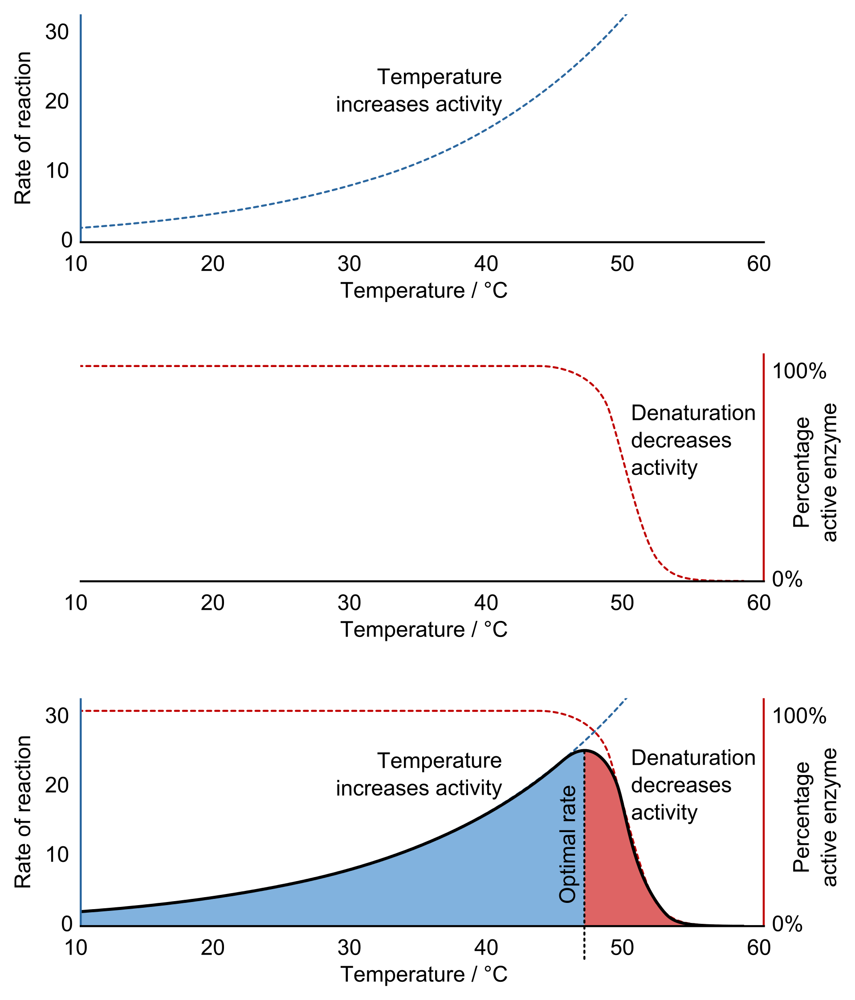
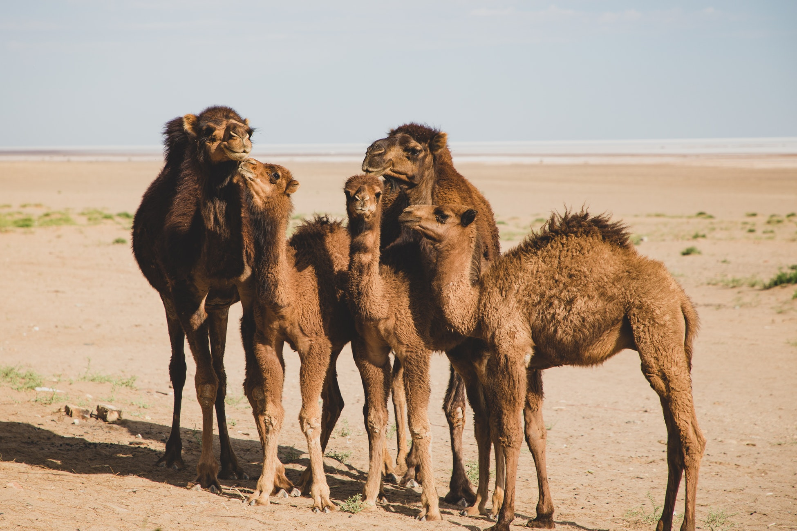

# Temperature  
Temperature is a quantity expressing of the amount of heat. Because a rate of every chemical reaction occurs in the animal's body is affected by the temperature, it is a very important factor to all animals. Like most chemical reactions, an enzyme-catalyzed reaction rate in the animal's body increases as the temperature is raised. 

<!-- The molecular structure of enzyme is broken -->
<!-- However, as the high temperature breaks the structure of the enzyme,  -->
<!-- On the other hand, lower temperatures lead to slower chemical reactions.  -->
<!-- In the case of enzymatic reactions, this is complicated by the fact that many enzymes are adversely affected by high temperatures.  -->

```{r q10, fig.cap="The effects of temperature on enzyme activity [@q10]. Top - increasing temperature increases the rate of reaction (Q10 coefficient). Middle - the fraction of folded and functional enzyme decreases above its denaturation temperature. Bottom - consequently, an enzyme's optimal rate of reaction is at an intermediate temperature.", echo = FALSE, out.width = "60%"}


```


## Poikilotherm and homeotherm


## Thermoregulation

```{r norm-body-temp, tab.cap="Normal body temperature of the domestic animals", tidy=FALSE, echo=FALSE, message=FALSE}
tibble::tribble(
  ~"Animal", ~"Normal temperature (°C)", ~"Animal", ~"Normal temerature (°C)",
  "Cattle", "38.5", "Donkey", "38.2",
  "Calf", "39.5", "Chicken", "42.0",
  "Buffalo", "38.2", "Camel", "34.5-41.0",
  "Sheep", "39.0",  "Horse", "38.0",
  "Llama, alpaca", "38.0", "Pig", "39.0",
  "Goat", "39.5", "Piglet", "39.8"
) %>% knitr::kable(caption = "Normal body temperature of the domestic animals; Body temperatures may be 1°C above or below these temperatures.", booktabs = TRUE)
```

## Temperature humadity index (THI)  

## Effects on production
### Dairy cattle
### Beef cattle
### Swine
### Poultry


(Isfahan Province, Aran o Bidgol, Iran)  
