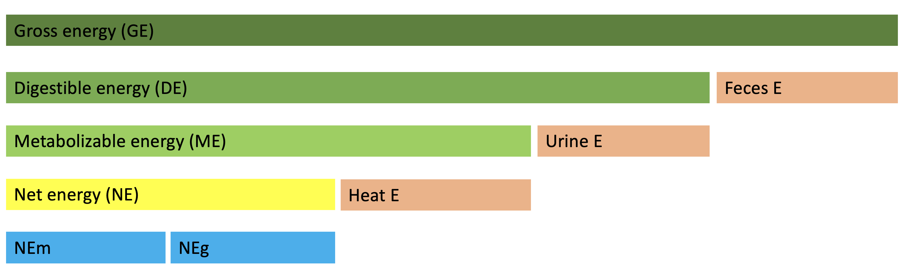
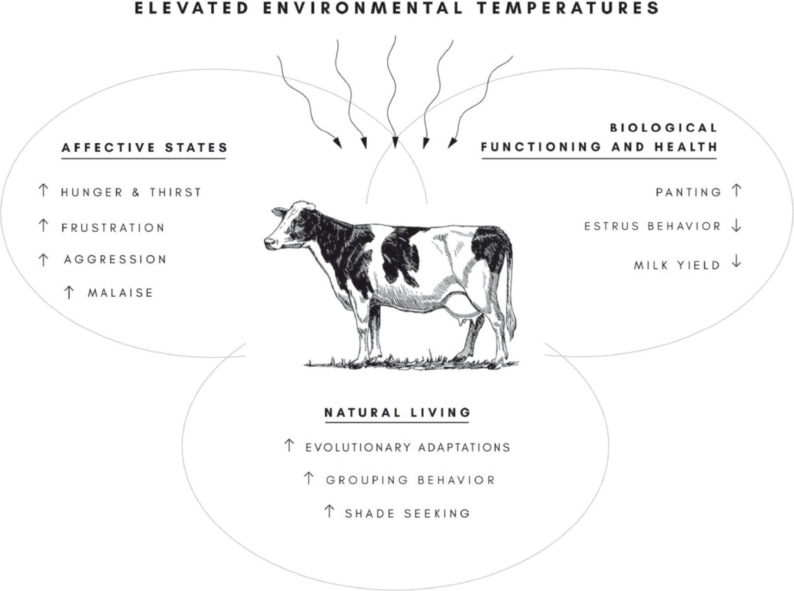

# Temperature  
Temperature is a quantity expressing of the amount of heat. Because a rate of every chemical reaction occurs in the animal's body is affected by the temperature, it is a very important factor to all animals. Like most chemical reactions, an enzyme-catalyzed reaction rate in the animal's body increases as the temperature is raised. However, extremely high or low temperature results in loss of activity or lose the structure for most enzymes (*denaturation*; Figure \@ref(fig:q10)). 

```{r q10, fig.cap="The effects of temperature on enzyme activity [@q10]. Top - increasing temperature increases the rate of reaction (Q10 coefficient). Middle - the fraction of folded and functional enzyme decreases above its denaturation temperature. Bottom - consequently, an enzyme's optimal rate of reaction is at an intermediate temperature.", echo = FALSE, out.width = "60%", fig.align='center'}

knitr::include_graphics("figures/q10.png")
```

## Poikilotherm and homeotherm

Key factors for animal surviving are to adapt to external environmental changes and maintain a consistent internal environment. The animal can be divided into two types for response to external temperatures: *poikilotherm* (cold-blooded animals) and *homeotherm* (warm-blooded animals). Examples of poikilotherms are most fish, amphibians, and reptiles. Their internal body temperature varies considerably according to their external environments. On the other hand, homeotherm maintains their thermal homeostasis regardless of the external temperature. The examples of homeotherm are birds and mammals.

```{r body-temp-comparision, fig.cap="Comparison of body temperature response by snake (poikiloterm) and bobcat (homeoterm) to changing ambient temperature.", echo=FALSE, message=FALSE, fig.width=6, fig.height=4.5, fig.align='center'}

library(tidyverse)

tibble::tribble(
  ~"animal", ~"ambient", ~"body",
  "Snake", 3, 2.8,
  "Snake", 10, 10.1,
  "Snake", 20, 19.8,
  "Snake", 30, 30.8,
  "Snake", 35, 36.0,
  "Snake", 40, 39.0,
  "Bobcat", 3, 36.3,
  "Bobcat", 10, 36.5,
  "Bobcat", 20, 36.6,
  "Bobcat", 30, 37.0,
  "Bobcat", 35, 37.5,
  "Bobcat", 40, 37.5
) %>%
  ggplot(aes(ambient, body, color = animal)) +
  geom_point(size = 2) +
  geom_line() +
  xlab("Ambient temperature, °C") +
  ylab("Body temperature, °C") 
```

### Poikilotherm

The term derives from the acient Greek language *poikilos* (ποικίλος; changeable) and *thermos* (θερμός; heat). The body temperature of poikilotherms varies considerably than those of homeotherms (Figure \@ref(fig:body-temp-comparision)). They generally use solar radiation for maintaining their body temperature and have four to ten enzyme systems that can operate at different ambient temperature because the temperature affects the chemical reactions.

```{r flor, fig.cap="Green frog on blue surface.", echo = FALSE, out.width = "100%", fig.align='center'}


```

### Homeoterm

Homeotherms can maintain body temperature independently from ambient temperatures by regulating the metabolic process. They preserve their body temperature by muscle contraction and brown adipose tissue is catabolized for heat production [@grigg2004evolution]. In hot environments, they use evaporative cooling (sweating or panting) for maintaining their body temperature. Most of the domestic animals are homeotherm.

```{r e-system, fig.cap="Overview of feed energy flow through the animal body", echo = FALSE, out.width = "100%", fig.align='center'}


```

```{r kimetal, fig.cap="Infrared cameras image that cows generating the heats. @kim2018image developed the algorithms for tracking the cows using IR camera video.", echo = FALSE, out.width = "100%", fig.align='center'}

if (knitr:::is_latex_output()) {
  knitr::include_graphics("figures/kimetal.png")
} else {
  knitr::include_graphics("figures/kimetal.gif")
}
```

In some homeoterms (bears, hedgehog, marmot, and so on) and poikilotherms (frogs, turtles, snake, and so on), they can enter the *hibernation* in the cold season: the body temperature is dropped, and the metabolic rate is depressed. Hibernating bears can recycle their body proteins and urine to avoid muscle loss.


### Heterotherm

Heterotherms exhibit the characteristics of both poikilotherm and homeotherm. They can switch between poikilothermic and homeothermic strategies. In some bat species, for example, body temperature and metabolic rate are elevated only when they are active. When they at rest, metabolic rate is drastically dropped thereby the body temperature is decreased to the ambient temperature. 

## Thermoregulation

Thermoregulation is a process to maintain the internal temperature within certain boundaries. In homeotherms, thermoregulatory physiology is mainly controlled by nervous and endocrine systems. The core temperature of the animal is primarily regulated by the hypothalamus. If the ambient temperature is going to cold, they generate heat via metabolic processes to keep their body temperature. In contrast, in hot conditions, sweat glands release sweat for evaporates and the blood vessels going to wider for increasing the blood flow to the skin. 

```{r norm-body-temp, tab.cap="Normal body temperature of the domestic animals", tidy=FALSE, echo=FALSE, message=FALSE, fig.align='center'}
tibble::tribble(
  ~"Animal", ~"Normal temperature (°C)", ~"Animal", ~"Normal temerature (°C)",
  "Cattle", "38.5", "Donkey", "38.2",
  "Calf", "39.5", "Chicken", "42.0",
  "Buffalo", "38.2", "Camel", "34.5-41.0",
  "Sheep", "39.0",  "Horse", "38.0",
  "Llama, alpaca", "38.0", "Pig", "39.0",
  "Goat", "39.5", "Piglet", "39.8"
) %>% knitr::kable(caption = "Normal body temperature of the domestic animals; Body temperatures may be 1°C above or below these temperatures.", booktabs = TRUE)
```

In poikilotherms, they use external sources of temperature to keep their body temperatures (Table \@ref(tab:cooling)). To regulate their body temperature, they sometimes climbing the trees, entering the warm water, lying on the cool ground, or lying in the sun. There are some methods for thermoregulation in poikilotherms: *convection*, *conduction*, and *radiation*. Convection is the transfer of heat via the movement of molecules within fluids (gases or liquids). Conduction is the transfer of heat via the direct molecular collision. Radiation is the transfer of heat in the form of waves or particles (sunlight is the most familiar forms of radiation). Once there’s a thermal equilibrium between the animal and environment, the thermal exchange will be stopped.

```{r cooling, tab.cap="Cooling and heating methods for poikilotherms", tidy=FALSE, echo=FALSE, message=FALSE, warning=FALSE}
library(tidyverse)
tibble::tribble(
  ~"Methods", ~"Cooling", ~"Heating",
   "Convection", "Increasing blood flow to body surfaces", "Entering a warm water or air current; Building an insulated nest or burrow",
  "Conduction", "Lying on cool ground; Staying wet in a river, lake or sea; Covering in cool mud", "Lying on a hot surface",
  "Radiation", "Get away from the sun", "Lying in the sun; Folding skin to reduce exposure"
) %>%
  knitr::kable(caption = "Cooling and heating methods for poikilotherms", booktabs = TRUE)
```


## Temperature humidity index (THI)  

The productivity of domestic animals is primarily affected by air temperature, and altered by wind, humidity, and radiation. Temperature–humidity index (THI) is a combination of temperature and humidity that is a measure of the degree of discomfort experienced by an individual in warm weather (a.k.a. discomfort index). This unitless index was first introduced by Thom (1959) to describe the effect of ambient temperature on humans but has been adapted to describe thermal conditions that drive heat stress in dairy cattle (De Rensis et al., 2015). Temperature-humidity index for dairy cow is calculated as 

$THI = (0.8*T) + [H*(T - 14.4)] + 46.4$

where T is the air temperature and H is the relative humidity. The THI is a useful tool for predicting the heat stress of cows, however, it does not account for solar radiation and wind speed which can affect the heat load of cattle.

```{r THI, fig.cap="THI chart for dairy cows. Yellow = Stress Threshold Respiration rate exceeds 60 BPM. Milk yield losses begin. Repro losses detectable. Rectal Temperature exceeds 38.5°C (101.3°F). Orange = Mild-Moderate Stress Respiration Rate Exceeds 75 BPM. Rectal Temperature exceeds 39°C (102.2°F). Red = Moderate-Severe Stress Respiration Rate Exceeds 85 BPM Rectal Temperature exceeds 40 °C (104°F). Purple = Severe Stress. Respiration Rate 120-140 BPM. Rectal Temperature exceeds 41 °C (106°F)", echo = FALSE, out.width = "100%", fig.align='center'}

knitr::include_graphics("figures/THI.png")
```


## Effects heat stress on the animal production and health  

Homeotherms have optimal temperature zones for production within which no additional energy above maintenance is expended to heat or cool the body. The range for lactating dairy cows is estimated to be from −0.5 to 20°C (Johnson, 1987). 

### Dairy cattle
```{r heat-dairy, fig.cap="The relationship between the immediate effects of environmental heat stress and the 3 key constructs of animal welfare: (1) the biological functioning (and health) of the animal, (2) the affective states the animal is experiencing, and (3) the naturalness of its life under current heat management strategies (Polsky et al., 2017).", echo = FALSE, out.width = "100%", fig.align='center'}

```

**Heat stress decreases milk production.** Lactating dairy cows have an increased sensitivity to heat stress compared with nonlactating (dry) cows, due to milk production elevating metabolism (Purwanto et al., 1990). Moreover, because of the positive relationship between milk yield and heat production, higher yielding cows are more challenged by heat stress than lower yielding animals (Spiers et al., 2004).  

When a cow becomes heat stressed, an immediate coping mechanism is to reduce DMI, causing a decrease in the availability of nutrients used for milk synthesis (West, 2003; Rhoads et al., 2009). Simultaneously, there is an increase in basal metabolism caused by activation of the thermoregulatory system. Mild to severe heat stress can increase metabolic maintenance requirements by 7 to 25% (NRC, 2001).

**Heat stress decreases reproductivity**. The decrease in conception rates during summer seasons can range between 20 and 30%, with evident seasonal patterns of estrus detection (De Rensis and Scaramuzzi, 2003). Elevated environmental temperatures negatively affect the cow's ability to display natural mating behavior, as it reduces both the duration and intensity of estrous expression (Orihuela, 2000). A reduction in estrous behavior has been argued to be the result of reduced DMI and the subsequent effects on hormone production (Westwood et al., 2002). 
Decreased milk production and declining reproductive success are the most commonly examined components of a heat-stressed dairy cow's health. 

Alterations in housing and management strategies have attempted to mitigate the heat stress. Basically, various cooling options for dairy cows exist based on the principles of convection, conduction, radiation, and evaporation. 

1. **Fan installations**, which facilitate air movement and increase convection, have been used to reduce environmental temperatures and mitigate heat stress by decreasing respiratory rate and rectal temperature and increasing DMI (Armstrong, 1994). 

2. **High-pressure mist injected into fans** (which function to cool the microclimate air that the cows inspire) or large water droplets from low-pressure sprinkler systems that completely wet the cow by soaking the hair coat.

3. **Physical structures** that provide shade such as trees, roofs, or cloth can create more hospitable microclimates for cows because of the reduction in solar radiation exposure and decline in ambient temperature. 

4. **Barn orientation** (depending on geographic location) can also help mitigate heat stress by reducing the insolation and stall surface temperature.

### Beef cattle

As temperatures heat up during the summer cattle producers need to assess the heat stress that their cattle are under. Typically pastured cattle are not as susceptible to heat stress as feedlot cattle. Pastured cattle have the ability to seek shade, water and air movement to cool themselves.

Compared to other animals cattle cannot dissipate their heat load very effectively. Cattle do not sweat effectively and rely on respiration to cool themselves. Cattle should not be worked during times of extreme heat and only early in morning when it is hot. 

Cattle’s core temperature peaks 2 hours after peak environmental temperature. It also takes at least 6 hours for cattle to dissipate their heat load. Therefore, if peak temperature occurred at 4:00 pm cattle will not have recovered from that heat load until after 12:00 am and it will be later than that before cattle have fully recovered from the entire days heat load. Special attention should be paid to cattle with increased risk of heat stress including heavy cattle, black cattle and respiratory compromised animals.

#### Heat stress management

1. The water requirements of cattle increases during heat stress. Cattle lose water from increased respiration and perspiration. **Consumption of water** is the quickest method for cattle to reduce their core body temperature. 

2. Heat production from feed intake peaks 4 to 6 hours after feeding. Therefore heat production in cattle fed in the morning will peak in the middle of the day when environmental temperatures are also elevated. **Changing the ration** indicates that lowering the energy content of diet will decrease the heat load. The general recommendation is to reduce the diet energy content by 5 to 7%.

3. **Increasing the air flow** can help cattle cope with extreme heat events. Wind speed has been shown to be associated with ability of cattle to regulate their heat load. 

4. **Sprinklers** can be used to cool cattle during times of stress. Sprinklers increase evaporative cooling and can reduce ground temperature. Sprinklers should thoroughly wet the animal and not just mist the air in order to cool the animal. Sprinklers should be placed away from feed bunks and waterers. Cattle need to be introduced to sprinklers prior to extreme heat. 
  
### Canine   

When a dog is exposed to high temperatures, heat stroke or heat exhaustion can result. Heat stroke is a very serious condition that requires immediate medical attention. Dogs do not sweat through their skin like humans. They release heat primarily by panting and they sweat through the foot pads and nose. If a dog cannot effectively expel heat, the internal body temperature begins to rise. Once the dog’s temperature reaches 41°C damage to the body’s cellular system and organs may become irreversible.  

Signs of heat stroke are 1) increasing the rectal temperature, 2) vigorous panting, 3) dark red gums, 4) tacky or dry mucus membranes (specifically the gums), 5) lying down and unwilling (or unable) to get up, and/or 6) dizziness or disorientation.  

#### Treatments for heat stroke  

1. Move your dog out of the heat and away from the sun right away.  
2. Begin cooling your dog by placing cool, wet rags or washcloths on the body.  
3. Do not use ice or cold water. Extreme cold can cause the blood vessels to constrict, preventing the body’s core from cooling and actually causing the internal temperature to further rise. When the body temperature reaches 39.5°C, stop cooling. 
4. Offer your dog cool water, but do not force water into your dog’s mouth.  

#### Preventing the heat stroke
1. Never leave your dog alone in the car on a warm day, regardless of whether the windows are open. Even if the weather outside is not extremely hot, the inside of the car acts like an oven.  
2. Avoid vigorous exercise on warm days.  
3. Keep fresh cool water available at all times.  
4. Certain types of dogs are more sensitive to heat – especially obese dogs and short-nosed breeds, like Pugs and Bulldogs (Figure \@ref(fig:heat-canine)).  

```{r heat-canine, fig.cap="Certain types of dogs are more sensitive to heat – especially obese dogs and short-nosed breeds, like Pugs and Bulldogs.", echo = FALSE, out.width = "100%", fig.align='center'}
knitr::include_graphics("figures/pug.jpeg")
```

### Swine  


### Poultry


