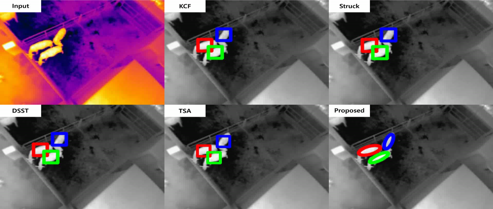

# Temperature  
Temperature is a quantity expressing of the amount of heat. Because a rate of every chemical reaction occurs in the animal's body is affected by the temperature, it is a very important factor to all animals. Like most chemical reactions, an enzyme-catalyzed reaction rate in the animal's body increases as the temperature is raised. However, extremely high or low temperature results in loss of activity or lose the structure for most enzymes (*denaturation*; Figure \@ref(fig:q10)). 

```{r q10, fig.cap="The effects of temperature on enzyme activity [@q10]. Top - increasing temperature increases the rate of reaction (Q10 coefficient). Middle - the fraction of folded and functional enzyme decreases above its denaturation temperature. Bottom - consequently, an enzyme's optimal rate of reaction is at an intermediate temperature.", echo = FALSE, out.width = "60%", fig.align='center'}

knitr::include_graphics("figures/q10.png")
```

## Poikilotherm and homeotherm

Key factors for animal surviving are to adapt to external environmental changes and maintain a consistent internal environment. The animal can be divided into two types for response to external temperatures: *poikilotherm* (cold-blooded animals) and *homeotherm* (warm-blooded animals). Examples of poikilotherms are most fish, amphibians, and reptiles. Their internal body temperature varies considerably according to their external environments. On the other hand, homeotherm maintains their thermal homeostasis regardless of the external temperature. The examples of homeotherm are birds and mammals.

```{r body-temp-comparision, fig.cap="Comparison of body temperature response by snake (poikiloterm) and bobcat (homeoterm) to changing ambient temperature.", echo=FALSE, message=FALSE, fig.width=6, fig.height=4.5, fig.align='center'}

library(tidyverse)

tibble::tribble(
  ~"animal", ~"ambient", ~"body",
  "Snake", 3, 2.8,
  "Snake", 10, 10.1,
  "Snake", 20, 19.8,
  "Snake", 30, 30.8,
  "Snake", 35, 36.0,
  "Snake", 40, 39.0,
  "Bobcat", 3, 36.3,
  "Bobcat", 10, 36.5,
  "Bobcat", 20, 36.6,
  "Bobcat", 30, 37.0,
  "Bobcat", 35, 37.5,
  "Bobcat", 40, 37.5
) %>%
  ggplot(aes(ambient, body, color = animal)) +
  geom_point(size = 2) +
  geom_line() +
  xlab("Ambient temperature, °C") +
  ylab("Body temperature, °C") 
```

### Poikilotherm

The term derives from the acient Greek language *poikilos* (ποικίλος; changeable) and *thermos* (θερμός; heat). The body temperature of poikilotherms varies considerably than those of homeotherms (Figure \@ref(fig:body-temp-comparision)). They generally use solar radiation for maintaining their body temperature and have four to ten enzyme systems that can operate at different ambient temperature because the temperature affects the chemical reactions.

```{r flor, fig.cap="Green frog on blue surface.", echo = FALSE, out.width = "100%", fig.align='center'}

knitr::include_graphics("figures/flog.jpeg")
```

### Homeoterm

Homeotherms can maintain body temperature independently from ambient temperatures by regulating the metabolic process. They preserve their body temperature by muscle contraction and brown adipose tissue is catabolized for heat production [@grigg2004evolution]. In hot environments, they use evaporative cooling (sweating or panting) for maintaining their body temperature. Most of the domestic animals are homeotherm.

In some homeoterms (bears, hedgehog, marmot, and so on) and poikilotherms (frogs, turtles, snake, and so on), they can enter the *hibernation* in the cold season: the body temperature is dropped, and the metabolic rate is depressed. Hibernating bears can recycle their body proteins and urine to avoid muscle loss.


```{r kimetal, fig.cap="Infrared cameras image that cows generating the heats. @kim2018image developed the algorithms for tracking the cows using IR camera video.", echo = FALSE, out.width = "100%", fig.align='center'}

if (knitr:::is_latex_output()) {
  
} else {
  knitr::include_graphics("figures/kimetal.gif")
}
```

### Heterotherm

Heterotherms exhibit the characteristics of both poikilotherm and homeotherm. They can switch between poikilothermic and homeothermic strategies. In some bat species, for example, body temperature and metabolic rate are elevated only when they are active. When they at rest, metabolic rate is drastically dropped thereby the body temperature is decreased to the ambient temperature. 

## Thermoregulation

Thermoregulation is a process to maintain the internal temperature within certain boundaries. In homeotherms, thermoregulatory physiology is mainly controlled by nervous and endocrine systems. The core temperature of the animal is primarily regulated by the hypothalamus. If the ambient temperature is going to cold, they generate heat via metabolic processes to keep their body temperature. In contrast, in hot conditions, sweat glands release sweat for evaporates and the blood vessels going to wider for increasing the blood flow to the skin. 

```{r norm-body-temp, tab.cap="Normal body temperature of the domestic animals", tidy=FALSE, echo=FALSE, message=FALSE, fig.align='center'}
tibble::tribble(
  ~"Animal", ~"Normal temperature (°C)", ~"Animal", ~"Normal temerature (°C)",
  "Cattle", "38.5", "Donkey", "38.2",
  "Calf", "39.5", "Chicken", "42.0",
  "Buffalo", "38.2", "Camel", "34.5-41.0",
  "Sheep", "39.0",  "Horse", "38.0",
  "Llama, alpaca", "38.0", "Pig", "39.0",
  "Goat", "39.5", "Piglet", "39.8"
) %>% knitr::kable(caption = "Normal body temperature of the domestic animals; Body temperatures may be 1°C above or below these temperatures.", booktabs = TRUE)
```

In poikilotherms, they use external sources of temperature to keep their body temperatures (Table \@ref(tab:cooling)). To regulate their body temperature, they sometimes climbing the trees, entering the warm water, lying on the cool ground, or lying in the sun. There are some methods for thermoregulation in poikilotherms: *convection*, *conduction*, and *radiation*. Convection is the transfer of heat via the movement of molecules within fluids (gases or liquids). Conduction is the transfer of heat via the direct molecular collision. Radiation is the transfer of heat in the form of waves or particles (sunlight is the most familiar forms of radiation). Once there’s a thermal equilibrium between the animal and environment, the thermal exchange will be stopped.

```{r cooling, tab.cap="Cooling and heating methods for poikilotherms", tidy=FALSE, echo=FALSE, message=FALSE, warning=FALSE}
library(tidyverse)
tibble::tribble(
  ~"Methods", ~"Cooling", ~"Heating",
   "Convection", "Increasing blood flow to body surfaces", "Entering a warm water or air current; Building an insulated nest or burrow",
  "Conduction", "Lying on cool ground; Staying wet in a river, lake or sea; Covering in cool mud", "Lying on a hot surface",
  "Radiation", "Get away from the sun", "Lying in the sun; Folding skin to reduce exposure"
) %>%
  knitr::kable(caption = "Cooling and heating methods for poikilotherms", booktabs = TRUE)
```


## Temperature humadity index (THI)  

The productivity of domestic animals is primarily affected by air temperature, and altered by wind, humidity, and radiation.

## Effects on production
### Dairy cattle
### Beef cattle
### Swine
### Poultry


