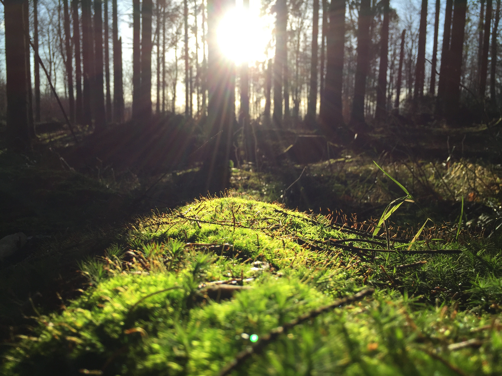

# Photoperiodism  

The main source of light on th earth is the sun. Sunlight provides the energy that green plants use to create sugars mostly in the form of starches, which release energy into the living things that digest them. This process of photosynthesis provides virtually all the energy used by living things. Some species of animals generate their own light, a process called bioluminescence. For example, fireflies use light to locate mates, and vampire squids use it to hide themselves from prey.

```{r sunlight, fig.cap="Sunlight", echo = FALSE, out.width = "100%", fig.align='center'}

```

Daylight is the combination of all direct and indirect sunlight during the daytime. Daytime is the period of time each day when daylight occurs. **Daylight happens as the earth rotates, and either side on which the sun shines is considered daylight.** Illuminance is a measure of how much luminous flux is spread over a given area. The lux (symbol: lx) is the SI derived unit of illuminance.

```{r intensity, tab.cap="Light intensity in different conditions.", tidy=FALSE, echo=FALSE, message=FALSE, fig.align='center'}
library(magrittr)
tibble::tribble(
  ~"Illuminance", ~"Example",
  "120,000 lux", "Brightest sunlight",
  "111,000 lux", "Bright sunlight",
  "20,000 lux", "Shade illuminated by entire clear blue sky, midday",
  "1,000-2,000 lux", "Typical overcast day, midday",
  "400 lux", "Sunrise or sunset on a clear day",
  "0.25 lux", "A full Moon, clear night sky",
  "0.01 lux", "A quarter Moon, clear night sky"
) %>% knitr::kable(caption = "Light intensity in different conditions.", booktabs = TRUE)
```

Photoperiodic response is the physiological reaction of organisms to the length of day or night. A number of biological and behavioural changes are dependent on the daylength. Together with temperature changes, photoperiod provokes changes in the color of fur and feathers, migration, entry into hibernation, sexual behaviour, and even the resizing of sexual organs.

In animals, the regular activities of migration, reproduction, and the changing of coats or plumage can be induced out of season by artificially altering daylight. Long periods of light followed by short periods will induce mating behaviour in species that normally breed in autumn (e.g. goats and sheep), while spring breeders (e.g. mink) will start the reproductive process when daylight is increased. Application of photoperiodism is common in the poultry industry, as daylight affects egg-laying, mating, and body weight of the fowl.

## Seasonal breeding
```{r sheep, fig.cap="Sheep breeds when the length of daylight shortens", echo = FALSE, out.width = "100%", fig.align='center'}

```

Seasonal breeders are animal species that successfully mate only during certain times of the year. These times of year allow for the optimization of survival of young due to factors such as ambient temperature, food and water availability, and changes in the predation behaviors of other species. Related sexual interest and behaviors are expressed and accepted only during this period. Female seasonal breeders will have one or more estrus cycles only when she is "in season" or fertile and receptive to mating. Male seasonal breeders may exhibit changes in testosterone levels, testes weight, and fertility depending on the time of year.

The hypothalamus is considered to be the central control for reproduction due to its role in hormone regulation. This is achieved specifically through changes in the production of the hormone GnRH. GnRH in turn transits to the pituitary where it promotes the secretion of the gonadotropins LH and FSH, both pituitary hormones critical for reproductive function and behavior, into the bloodstream.

Seasonal breeding readiness is strongly regulated by length of day (photoperiod) and thus season. Photoperiod likely affects the seasonal breeder through changes in melatonin secretion by the pineal gland that ultimately alter GnRH release by the hypothalamus. Seasonal breeders can be divided into groups based on fertility period. "Long day" breeders (e.g. Horse, hamsters, and mink) cycle when days get longer (spring) and are in anestrus in fall and winter. "Short day" breeders (e.g. Sheep and goats) cycle when the length of daylight shortens (fall) and are in anestrus in spring and summer. 

## Effects on productivity
### Wool

### Feathers
### Antlers
### Puberty
### Reproduction
### Behavior
### Light control in poultry production


## Appendix

<iframe width="640" height="360" src="https://www.youtube.com/embed/X8oWnbcLI40" frameborder="0" allow="accelerometer; autoplay; encrypted-media; gyroscope; picture-in-picture" allowfullscreen></iframe>
