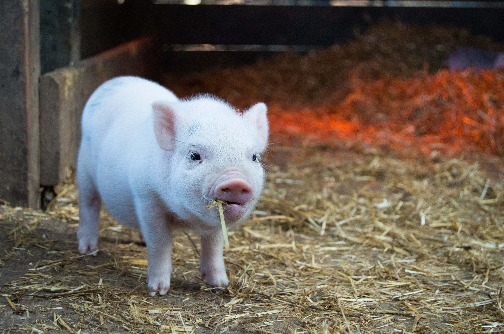
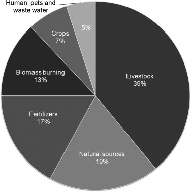
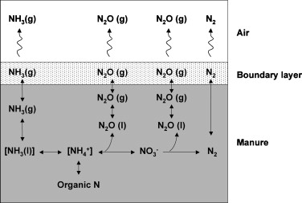

# Air quality

```{r pig-straw, fig.cap="A white piglet chewing hay", echo = FALSE,  out.width="100%", out.height="100%", fig.align='center'}

```

**[강의자료 보기: Air quality](https://youngjunna.github.io/aes/06-AirQuality)**

**Air quality is the degree of pollution of air.** The air quality can be determined by measuring the concentration of pollutants in the air. Air quality has a direct influence on health, welfare and production performance of livestock. The high concentrations of noxious gases, dust, and airborne microorganisms can reduce the production efficiency and the general welfare of farm animals. Long term exposure to particulates in livestock buildings might also affect the respiratory health of farm workers. Dust in animal buildings contains many biologically active substances such as bacteria, fungi, and endotoxins that are suspected to be hazardous to human health.

Airborne emissions include ammonia, methane, nitrous oxide, particulates like dust and microorganisms. In addition, other potentially harmful substances such as heavy metals, antibiotic residues and components of disinfectants might be also emitted from livestock building that are potentially damaging to ecosystems.

## Importance of air quality
Animals that continually exposed to bad air quality had reduced productivity and increased the stress. Maintaining good air quality is not only important for the productivity of the animals, but also for the welfare of the animals. 

**There are some benefits of improving the air quality:**  
1. Improves the health, welfare and production performance of the animals.  
2. Improves the health and safety of producers and workers.  
3. Reduces emissions of harmful pollutants to the outside environment which helps reduce nuisance complaints.  
4. Results in significant energy and economic savings.  
5. Prolongs the life of building structures.  

Generally air quality is affected by weather, livestock facilities and management conditions. Air quality is getting worse during light wind conditions, as pollutants cannot be blown away. 

## Pollutants

### Ammonia  

Ammonia (NH3) is an important pollutant gas that accelerates fine particulate formation in the atmosphere and plays a crucial role in the acidification and the eutrophication of ecosystems (Krupa, 2003). Livestock wastes account for 39% of global emissions (Fig. \@ref(fig:ammonia-manure)). Among them, pig production is globally responsible for about 15% of NH3 emissions associated to livestock, with a large variation by country (Olivier et al., 1998). 

```{r ammonia-manure, fig.cap="Repartition of sources of global ammonia emissions (Galloway et al., 2004).", echo = FALSE,  out.width="50%", fig.align='center'}

```

Ammonia is emitted from manure in livestock buildings, manure storage facilities and during manure application to soils. Ammonia in livestock facilities results primarily from the breakdown of urea (present in urine) by the enzyme urease (excreted in feces). Typical ammonia levels in well-ventilated buildings are 10 to 20 ppm. Ammonia can be easily removed from livestock buildings by proper ventilation because it is lighter than air.

```{r ammonia, tab.cap="Summary of effects in humans following acute ammonia exposure.", tidy=FALSE, echo=FALSE, message=FALSE, fig.align='center'}
library(magrittr)
tibble::tribble(
  ~"Concentration (mg/m3)", ~"Exposure time", ~"Effects reported",
  "3480", "30 min", "Death",
  "350", "30 min", "Nasal and throat irritation",
  "70", "6 h", "Transient irritation of eyes, nose, and throat",
  "56", "2 h", "Coughing, eyes, nose, and throat irritation",
  "35", "2 h", "No adverse effect",
  "0.5-37(mean = 3.5)", "", "Odour threshold",
  "12-14", "", "Odour complaint level"
) %>% knitr::kable(caption = "Summary of effects in humans following acute ammonia exposure.", booktabs = TRUE)
```

#### Nitrogen transformations and ammonia production in manure
Nitrogen transformations occurring in livestock manure include mineralization of organic N into NH3, N assimilation into organic matter, nitrification into nitrite (NO2−) and then into nitrate (NO3−), and finally denitrification into dinitrogen (N2) with nitrous oxide (N2O) as a potential by-product (Fig. \@ref(fig:ammonia-trans)).

```{r ammonia-trans, fig.cap="Nitrogen (N) transformation in livestock manure and releases to the atmosphere (NH3, ammonia; NH4+, ammonium; NO3−, nitrate; N2O, nitrous oxide; N2, dinitrogen; g, gaseous form; l, liquid form) (adapted from Philippe et al., 2011).", echo = FALSE,  out.width="50%", fig.align='center'}

```

#### Suppression methods
1. Decreasing of the length of the time manure remained.
2. Keeping buildings and the animals clean and dry.
3. Separation manure from urine.
4. Using acidifying agents to suppress ammonia emissions from manure.
5. Filtration.  
6. Landscaping: Trees, shrubs and other vegetative barriers planted around livestock buildings have the potential of reducing ammonia emissions.

#### Dietary strategies
1. Reduced crude protein (CP) diets containing synthetic amino acids have been shown to reduce N excretion, which leads to reduce NH3 emissions.
2. Reducing NH3 emissions from the slurry can also be achieved by the addition of fibrous feedstuffs in the diet. 
3. Feed additives: Non-starch polysaccharides enzymes, yucca extract, zeolites, probiotics, and so on.

### Hydrogen sulphide
Hydrogen sulfide (H2S) is a toxic gas and has potential to cause health problems if the concentration becomes too high. Hydrogen sulphide is heavier than air, soluble in water, and can accumulate in the livestock buildings. It has a rotten-egg odour and it can be easily detected at low concentrations.

#### Suppression methods
- Modifying diets to balance rations reduce hydrogen sulphide emissions.
- Frequent removal of manure from static pits significantly reduces hydrogen sulphide.
- Physical, chemical and biological treatment of stored manure such as manure additives and oil sprinkling.
- Biofiltration is an effective method for reducing the emissions of hydrogen sulphide.

### Particulate matters (Dust)
Particulate Matter (PM) is an unusual air pollutant in that it is defined by its physical morphology rather than chemical identity. The most common classifications are PM10 (coarse PM), which includes particles smaller than 10 μm in aerodynamic diameter, and
PM2.5 (fine or respirable PM), which includes particles smaller than 2.5 μm in diameter. 

- **PM10**: inhalable particles, with diameters that are generally 10 micrometers and smaller
- **PM2.5**: fine inhalable particles, with diameters that are generally 2.5 micrometers and smaller.

```{r pm-oecd, fig.cap="Population exposure to fine particulates (PM2.5).", echo = FALSE,  out.width="100%", fig.align='center'}
knitr::include_graphics("figures/pm-oecd.png")
```

**Dust from swine/pourtly barns originates from feed, bedding material, manure and the animals themselves.** Many of the respirable dust particles are odorous because of their fecal origin. The factors determining the amount of dust in confinement includes animal activity, temperature, relative humidity, and ventilation rate, stocking density and feeding methods.

Dust is related to the odor. Removal of dust in animal production facilities can reduce the odour in the air by 65-75% (Hammond and Smith 1981; Hartung 1985.Hartung, 1986; Hoff et al., 1997). Filtering the dust from the exhaust air reduced VOC–odor emissions from swine buildings by up to 65%. 

#### Factors affecting dust emissions 
1. **Temperature**: There is the negative correlation between outside temperature and the dust concentration.
2. **Relative humidity**: The humid air also increases the moister content of the dry manure or and settle dust, so that less dust become airborne.
3. **Animal Activity**

#### Suppression methods
1. **Ventilation**: The major method of controlling dust and air contamination in enclosed livestock facilities is by mechanical ventilation. 
2. **Air Misting**: The oil/water spraying is a promising technique for dust control in livestock buildings. 
3. **Fibrous Filter**
4. **Wet Collectors**: Wet scrubber using water to capture dust particle are very efficient in removing dust particles from air, however its use is not recommended in livestock building due to the needs for handling large amount of air in livestock buildings.