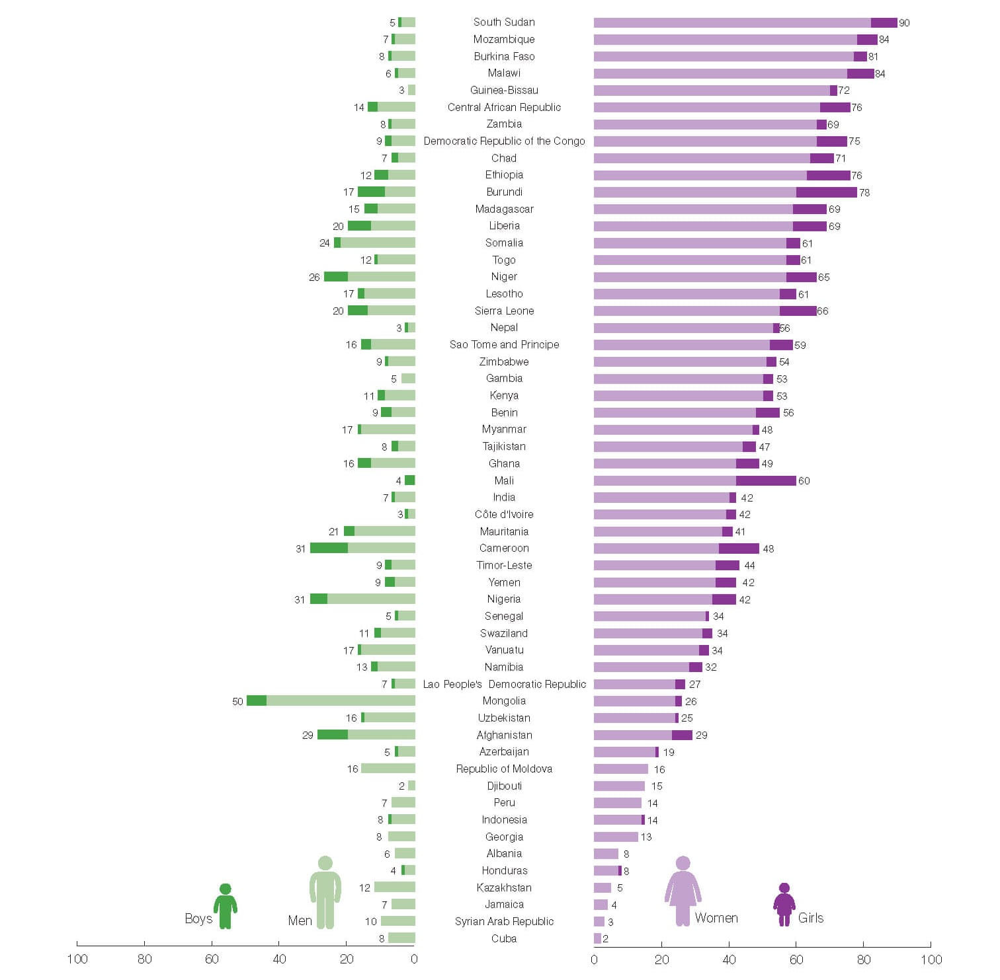
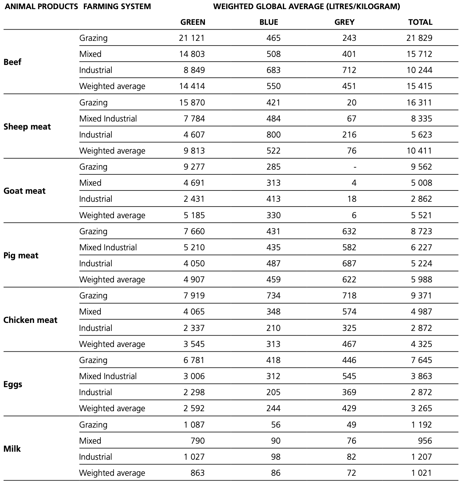

# Water quality

```{r water-pig, fig.cap="All living things, from tiny bacteria to giant blue whales, need water to survive.", echo = FALSE,  out.width="100%", out.height="100%", fig.align='center'}
knitr::include_graphics("figures/water-pig.jpeg")
```

Water is a critical nutrient for animal. An adequate and safe water supply is essential to the production of healthy animals. From transportation to lubrication to temperature regulation, water keeps animal life functioning. All chemical reactions in the bodies of animals use water as a medium.

**Water has the functions in the animal's body as:**  
1. Temperature regulation: Water acts as a buffer against overheating due to water's high specific heat.  
2. pH regulation: When the water introduced into an animal's system, it brings the pH closer to a neutral value.  
3. Hydrolysis and energy production  
4. Digestion  
5. Joint lubrication  

Measurements of water quality and quantity are required for effective planning and monitoring of water supplies for livestock. **If water quality is poor, livestock may drink less than they need or, rarely, may stop drinking.** When animals drink less, they will eat less and lose condition and if they are lactating, their milk production will reduce. Failure to provide proper and sufficient water for livestock not only affects production, it may be an animal welfare offence. Mangers must provide enough good quality water to meet the needs of the animal.

## Water salinity
Excessive salinity in livestock drinking water can reduce production. High levels of specific ions in water can cause animal health problems and death. The National Academy of Sciences offers upper limits for toxic substances in water (Table. \@ref(tab:water-toxic)). Unsafe levels of salts and ions depend on the amount of water consumed each day and the weight of the animal. The general guidelines presented in Table. \@ref(tab:water-toxic) include an appropriate margin of safety. 

```{r water-toxic, tab.cap="Recommendations for levels of toxic substances in drinking water for lilvestock.", tidy=FALSE, echo=FALSE, message=FALSE}
library(magrittr)
tibble::tribble(
  ~"Constituent", ~"Upper limit", ~"Constituent", ~"Upper limit",
  "Aluminum (Al)", "5.0 mg/L", "Lead (Pb)", "0.1 mg/L",
  "Arsenic (As)", "0.2 mg/L", "Manganese (Mn)", "no data",
  "Beryllium (Be)", "no data", "Mercury (Hg)", "0.01 mg/L",
  "Boron (B)", "5.0 mg/L", "Molybdenum (Mo)", "no data",
  "Cadmium (Cd)", "0.05 mg/L", "Nitrate + nitrite (NO3-N + NO2-N)", "100 mg/L",
  "Chromium (Cr)", "1.0 mg/L", "Nitrite (NO2-N)", "10 mg/L",
  "Cobalt (Co)", "1.0 mg/L", "Selenium (Se)", "0.05 mg/L",
  "Copper (Cu)", "0.5 mg/L", "Vanadium (V)", "0.10 mg/L",
  "Fluorine (F)", "2.0 mg/L", "Zinc (Zn)", "24 mg/L",
  "Iron (Fe)", "no data", "Total dissolved solids (TDS)", "10,000 mg/L"
) %>% knitr::kable(caption = "Recommendations for levels of toxic substances in drinking water for lilvestock. ", booktabs = TRUE)
```


## Microbiological contaminants
### Cyanobacteria
```{r cyanobacteria, fig.cap="Natural toxins originating from cyanobacteria are a primary concern in drinking water for livestock.", echo = FALSE,  out.width="100%", out.height="100%", fig.align='center'}
knitr::include_graphics("figures/cyanobacteria.jpg")
```

Natural toxins originating from cyanobacteria (blue-green algae) are a primary concern in drinking water for livestock. Cyanobacteria is a phylum of bacteria that obtain their energy through photosynthesis. Cyanobacteria are known to produce acute hepatotoxins, cytotoxins, neurotoxins, and toxins causing the gastrointestinal diseases. However, heavy cyanobacteria growth does not necessarily mean high levels of toxin. The trigger for cyanobacteria to produce toxins is not completely understood. If the cyanobacteria growth is not of the *Microcystis* species, there is a low probability of having high toxin levels. It is recommended that water contaminated with cyanobacteria should be avoided until the level of toxins is determined or until the water is treated. 

### Pathogens 

A variety of microbial pathogens can be transmitted to livestock from drinking water sources contaminated. The pathogens of greatest concern in water supplies for farm animals include enteric bacteria such as *E. coli*, *Salmonella* and *Campylobacter jejuni*. Other bacterial diseases known to affect livestock that may be transmitted through water supplies include *Leptospira, Burkholderia (Pseudomonas) pseudomallei*, and *Clostridium botulinum*. **Notably, the cause of biological contamination of water sources is associated with the animal industry itself**. For instance, in the situation of intensive livestock operation, the risk of water source contamination with animal waste may be very high. 


## Water treatment technologies

Water contaminants can be decreased considerably or even completely eliminated by a variety of treatment methods. Some methods are more effective than others, but for treating water for livestock consumption, economics are an important issue. 

### Activated carbon filters

```{r carbon-filter, fig.cap="Activated carbon filters.", echo = FALSE,  out.width="100%", out.height="100%", fig.align='center'}

```

This method is based on passing water through a filter containing activated carbon granules. Contaminants attach to the granules and are removed. Chlorine, some organic compounds associated with coloration, odour and offtaste of water, mercury, some pesticides and volatile organic compounds can be removed by this method. The filters must be inspected and replaced frequently. Poor filter maintenance will decrease effectiveness, and may result in bacterial growth on the filter, causing potential contamination of the water with pathogens. 

### Air stripping

Air stripping is the transferring of volatile components of a liquid into an air stream. It is an environmental engineering technology used for the purification of groundwaters and wastewaters containing volatile compounds. Contaminants are transferred from water to air and vented off. This method may be effective in removing hydrogen sulphide, some odours and tastes, and some volatile organic chemicals.

```{r Air-Stripper, fig.cap="Air-Stripper diagram (Monroe Environmental Corp., 2019).", echo = FALSE,  out.width="35%", fig.align='center'}
knitr::include_graphics("figures/Air-Stripper.png")
```

### Biological filters
Biological filtration is a natural process that takes place in rivers, streams, and oceans. Bacteria eat certain compounds, like ammonia, which is broken down into byproducts that are not toxic.  This method is effective at removing iron, arsenic, and organics. A microbiological layer is used to filter and consume contaminants.

### Chlorination
```{r swimming-pool, fig.cap="A swimming pool which treated chloride.", echo = FALSE,  out.width="100%", fig.align='center'}
knitr::include_graphics("figures/swimming-pool.jpeg")
```

This is one of the most common methods in water treatment for pathogen reduction in drinking water for livestock. Chlorination is much more effective if it follows a filtration system to remove large particles that can house bacteria. In particular, this is an effective and widely used method to kill many kinds of microorganisms in water. Chlorine content of the treated water should be monitored because the high concentrations of chlorine released to the animal water system may affect water intake and productivity.

### Ozonation  
This method of water treatment is based on application of ozone gas. Ozone is a very potent oxidizing agent, and destroys pathogenic microorganisms. It can reduce color, improves taste, odor, kills bacteria, viruses, oxidize iron, manganese, cyanide, phenol, benzene, chlorophenol, atrazine, nitrobenzene and other pollutants.  The equipment typically is quite expensive.  

## Importance of clean water to mankind

```{r global-water, fig.cap="Proportion of population using improved drinking water sources (WHO, 2015).", echo = FALSE,  out.width="100%", fig.align='center'}
knitr::include_graphics("figures/global_water_2015.png")
```

Safe and readily available water is important for public health, whether it is used for drinking, domestic use, food production or recreational purposes. Improved water supply and sanitation, and better management of water resources, can boost countries’ economic growth and can contribute greatly to poverty reduction.

**Billions of people have gained access to water, but huge inequalities remain.** In 2015, 71% of the global population (5.2 billion people) used a safely managed drinking-water service – that is, one located on premises, available when needed, and free from contamination. 89% of the global population (6.5 billion people) used at least a basic service. A basic service is an improved drinking-water source within a round trip of 30 minutes to collect water. 844 million people lack even a basic drinking-water service, including 159 million people who are dependent on surface water. Globally, at least 2 billion people use a drinking water source contaminated with faeces.

Contaminated water and poor sanitation are linked to transmission of diseases such as cholera, diarrhoea, dysentery, hepatitis A, typhoid, and polio. Inappropriately managed water and sanitation services expose individuals to preventable health risks. Some 842,000 people are estimated to die each year from diarrhoea as a result of unsafe drinking-water, sanitation, and hand hygiene. Yet diarrhoea is largely preventable, and the deaths of 361,000 children aged under 5 years could be avoided each year if these risk factors were addressed. 

In most countries, the majority of people spend less than 30 minutes collecting water, or have a piped supply within their home. But in some regions, especially sub-Saharan Africa, many people spend more than 30 minutes – and some more than an hour – on each trip to collect water. This burden still falls mainly on women and girls.

```{r water-girl, fig.cap="Who has primary responsibility for collecting water in rural areas? (WHO/Unicef joint monitoring program).", echo = FALSE,  out.width="100%", fig.align='center'}

```

## Livestock and sustainable management of water
Agriculture uses approximately 70% of the available freshwater supply, and roughly 30% of global agricultural water goes on livestock production (Ran et al., 2016), with one third of that supporting beef cattle (Mekonnen and Hoekstra, 2012). Besides water scarcity, one of the central water-related challenges facing the livestock sector is waste management and disposal given that feces and urine can be hazardous to the environment. 

The water footprint has been used as an indicator of water consumption for both direct and indirect water usage at consumer and producer level. It aims to measure the total volume of freshwater used to produce the goods and services consumed or utilized by individuals, communities and businesses.

```{r water-footprint, fig.cap="Water footprint values reported for selected food products (Mekonnen and Hoekstra, 2012).", echo = FALSE,  out.width="100%", fig.align='center'}

```