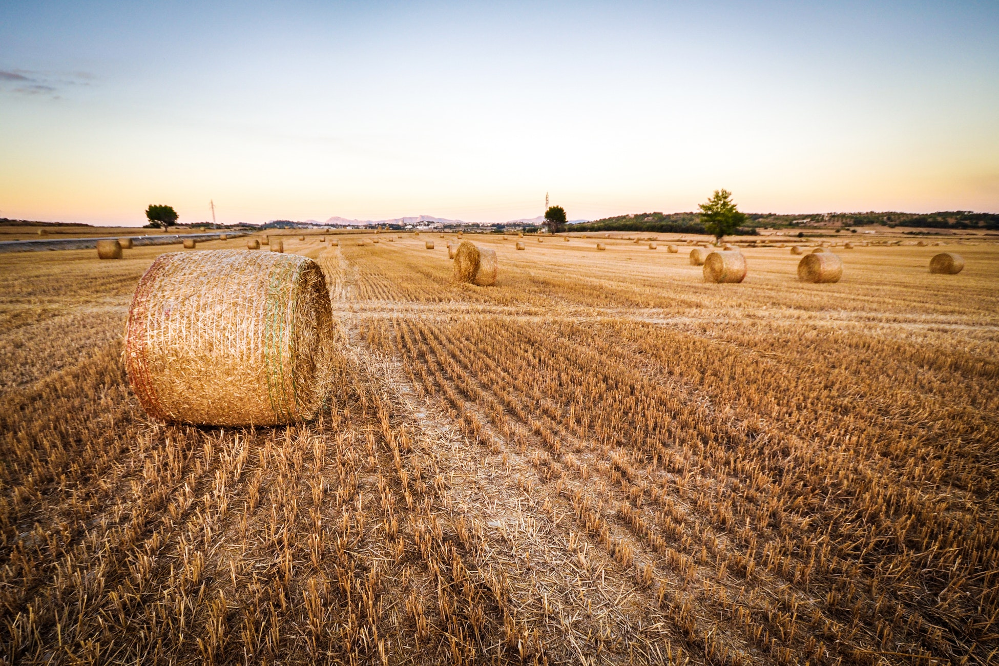
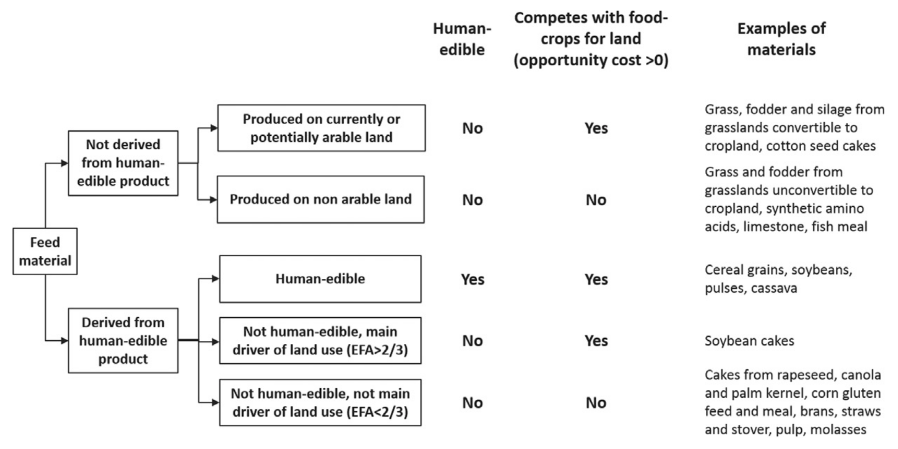
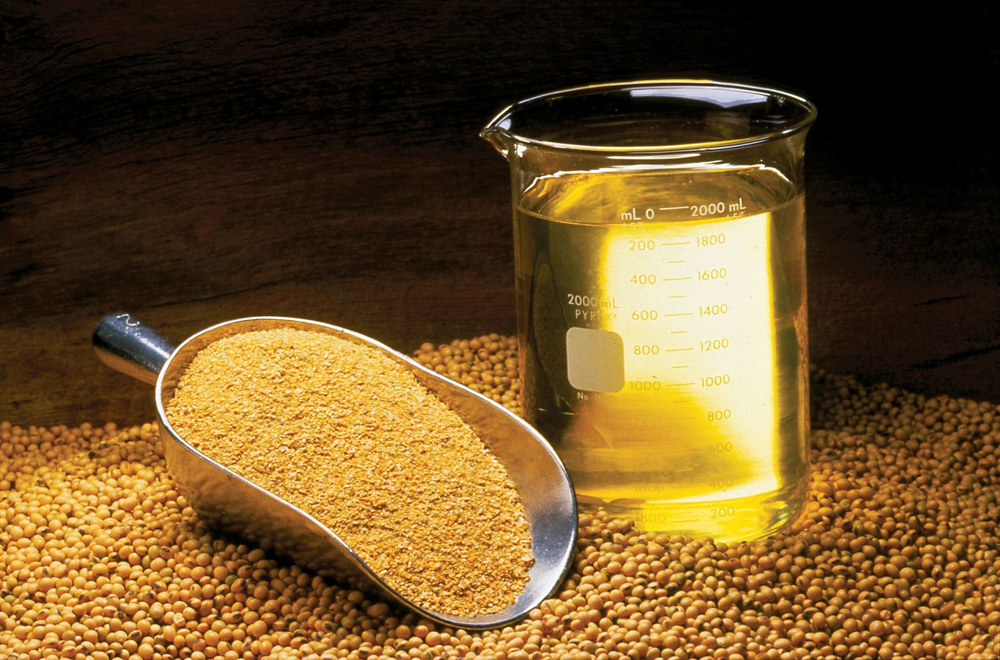

# Feed

```{r hay-feed, fig.cap="Proper feeding is key for a sustainable livestock industry.", echo = FALSE,  out.width="100%", fig.align='center'}

```

Feeding has a direct impact on the growth rate, production capacity and health status of the animal. Proper feeding is key for a profitable and sustainable farming.

The classification of feed materials is summarized in Fig. \@ref(fig:feed-classification). It is based first on whether the product from which they are derived is edible by humans (i.e. cerealgrains, soybeans, pulses, banana and cassava) or not (roughages suchas grass, crop residues and fodder beets, cotton and rape seeds). Second, only part ofthe product is used as feed. In that case, the Economic Fraction Allocation (EFA) is used to identify which co-product is the main driver of the land use. If the EFA of the part used as feed material is > 66%, then the feed material is considered as the main driver of land-use and therefore in competition with food production.

```{r feed-classification, fig.cap="Feed classification methodology (Mottet et al., 2017).", echo = FALSE,  out.width="100%", fig.align='center'}

```

## Agro by-product
```{r sbm, fig.cap="Soybean oil, meal and beans.", echo = FALSE,  out.width="100%", fig.align='center'}

```

In modern livestock industry, high amount of grains and pulses are necessary to meet the requirement of high producing animal, however, these ingredients are in competition with humans (Knaus, 2013). **An agricultural by-product is a secondary product generated during harvest or processing of grains, vegetables, and fruits.** Although most by-products are human-inedible, they contain adequate organic materials which can be used by domestic animals. For hundreds of years, the livestock industry has been typically used these agricultural by-products as a practical alternative feed ingredient (Grasser et al., 1995). Hence, **using human-inedible by-products as feed ingredient could diminish the dependence on grains and pulses in livestock industry** (Bocquier and González-García, 2010). In addition, if agricultural by-products are not disposed properly, it can cause the substantial environmental problems (Grasser et al., 1995). 

With their ability to convert human-inedible fibrous plant substrates into high-quality animal products, ruminants have always played a unique role in animal agriculture. However, the high performance levels of modern dairy and beef cattle have made it necessary to feed high amounts of grains and pulses to dairy cows, which also lead to an increase in the feed versus food competition between ruminants and humans (Knaus, 2009, 2013).

There are some examples of by-products: 

- Beer brewing waste is a by-product of the beer brewing industry, which ferments barley grains. This is a foodstuff high in protein and cell wall, all of which has high digestibility.

- Beet pulp before drying contains high levels of soluble carbohydrates and as calculated dry weight, it has an energetic value the same as or a little higher than cereals. Dry pulp, after heat and drying treatments, has for many years been a fully paid up member in the concentrates club for the dairy farm.

- Beet molasses or sugar cane molasses – the by-products after extraction of sugars from the plants. It contains high concentrations of minerals and proteins, mostly soluble proteins. CMS (Condensed Molasses Soluble) are also high in soluble protein and today, either with or without molasses they are standard additives in the ration.

- Citrus peels – a high energy food with a specific advantage because it contains high levels of pectin and non-structured carbohydrates. When fresh, citrus peels can be used on a daily basis and after fermentation and preservation, they can be used for long periods. As is true for dried pulp, dried citrus peels are also a good quality, standard component in the ration.

- In tropical regions, wastes from the banana growing industry are in widespread use, usually to feed mothers of meat calves and the calves themselves. In some tropical regions, the cattle are also fed sugar cane waste after extraction of the sugar, which is a high fiber food with very low value.

- Whey and other milk processing wastes are usually fed to pigs. Whey has a high energy value and other milk processing wastes contain considerable levels of both fat and protein. Whey is transported as a liquid, which requires a fleet of tankers and it is therefore difficult to exploit this resource to the full.

- Poultry manure from broiler chicken is a good source of protein for beef cattle and calves. In order to turn poultry manure into cattle feed, it must undergo a sterilization process to destroy pathogens. Foreign bodies and lumps must be removed. In Israel, where this source of food is forbidden for milking cows and fattening calves one month before marketing.

- Potatoes, carrots and other vegetables are good sources of available energy in the rumen, on condition that they are supplied fresh and without soil.

- Grape processing waste is a low value material, high in digestion depressant lignin and tannins. It can be used to cover silage pits, but it is not recommended as feed.

- Olive processing wastes, despite their lignin content, can be an efficient food because of their oil and protein content and as such they can be suitable as support for the straw fed to cattle living at maintenance level.

The exploitation of high moisture by-products is problematic because of their short storage life and the high moisture content, which can often lead to negative effects, such as overheating, low digestibility and low feed consumption. Although there are the high risk when using the by-products as the animal feed, using of the by-product is a very good chance that of improved profit margins along with a contribution to environmental.

## Appendix

[World mapping of animal feeding systems in the dairy sector](http://www.fao.org/3/a-i3913e.pdf)