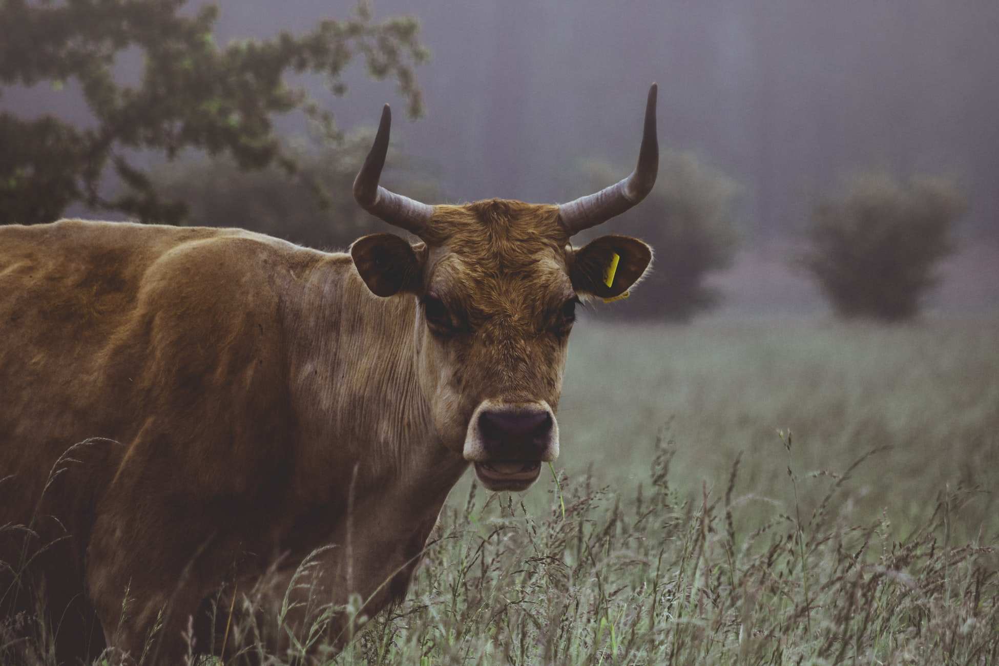

# Welcome {-}  

This is the website for **"Animal Environmental Science"**. To understanding individual animals, we have to understand the relationship they have with their environment. This book will focus at the interaction between animals and the environment.        

_CAUTION_: This website is now in progress. Some paragraphs borrowed the content and sentence from multiple author's as it is. However, it will be changed in the near future. The book is written in [RMarkdown](https://rmarkdown.rstudio.com) with [bookdown](https://bookdown.org). Some photographs used in this book was from [Unsplash.com](https://unsplash.com/). If you click the download button up above, you can download the PDF version of the book.

```{r echo = FALSE, out.width = "100%", fig.align='center'}


```

**Presentation files**  
1. [Animal and environment](https://youngjunna.github.io/aes/02-AnimalandEnvironment)  
2. [Temperature](https://youngjunna.github.io/aes/03-Temperature)  
3. [Genetics, nutrition, and environment](https://github.com/YoungjunNa/2019-animal-nutrition-and-the-environment/raw/master/03%E1%84%8C%E1%85%AE%E1%84%8E%E1%85%A1-%E1%84%83%E1%85%A9%E1%86%BC%E1%84%86%E1%85%AE%E1%86%AF%E1%84%92%E1%85%AA%E1%86%AB%E1%84%80%E1%85%A7%E1%86%BC%E1%84%92%E1%85%A1%E1%86%A8.pdf)  
4. [Light](https://youngjunna.github.io/aes/04-Light)  
5. [Human, animal, and environment](https://github.com/YoungjunNa/aes/raw/master/04-aes.pdf)  
6. [Sound](https://youngjunna.github.io/aes/05-Sound)  
7. [Air quality](https://youngjunna.github.io/aes/06-AirQuality)  
8. [Water quality](https://youngjunna.github.io/aes/07-WaterQuality)  
9. [Feed](https://youngjunna.github.io/aes/08-ByProducts)  
10. [Cycles of materials](https://youngjunna.github.io/aes/09-CyclesOfMaterials)  
11. [Recycle of manure](https://drive.google.com/file/d/1zayyDJWH9KQ0vKPsu2tNeH75u-USbIFv/view?usp=sharing)  
12. [Odor](https://drive.google.com/open?id=1Hze2tdsbKGxIF02kD9K_9p8RFX9vLFoE)  


```{r include=FALSE}
# automatically create a bib database for R packages
knitr::write_bib(c(
  .packages(), 'bookdown', 'knitr', 'rmarkdown'
), 'packages.bib')
```
