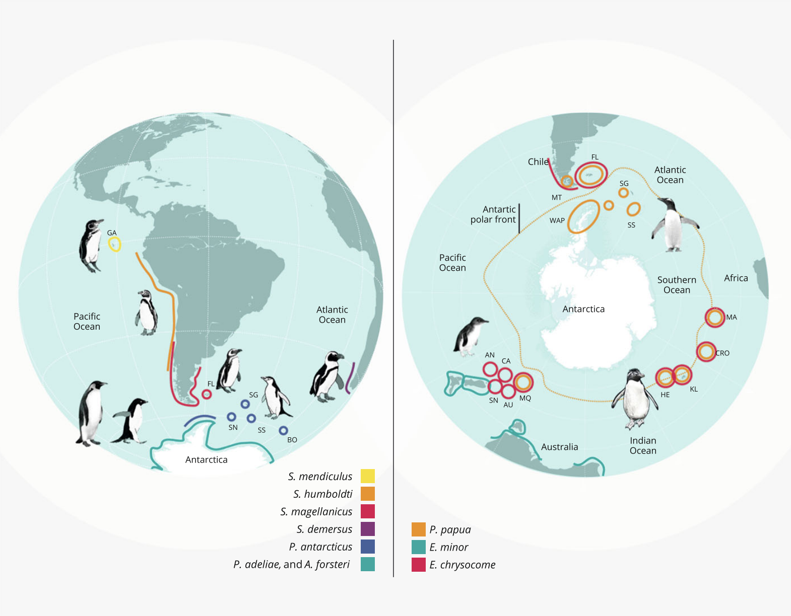
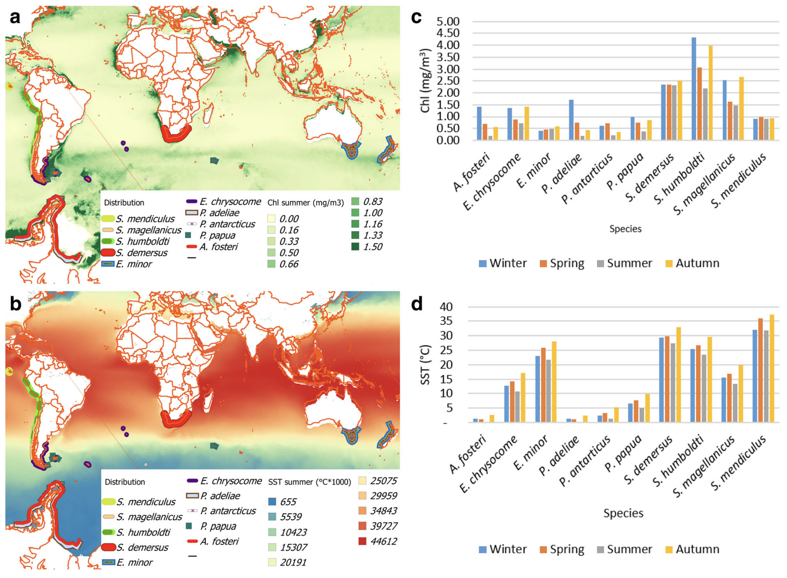
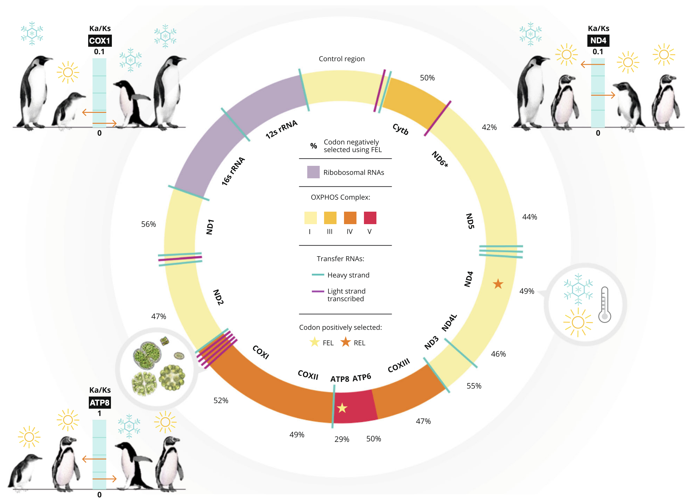

```{r setup, include=FALSE}
knitr::opts_chunk$set(echo = FALSE)
```


## Adaptation
> "Changes in morphological, anatomical, physiological, biochemical and behavioral characteristics of the animal which promote welfare and favor survival in a specific environment." --- Hafez  

Hafez defined an adaptation as above. The adaptation helps an animal survive in their external environment. 
The representative adaptive traits are:

  1. Structural adaptation
  2. Behavioral adaptation
  3. Physiological adaptation

## 

- **Structural** adaptation is the changes in physical features (e.g. body shape, skin, and internal organs) of the animal. 
- **Behavioral** adaptation is the changes in behaviors (e.g. searching for food, mating, vocalizations, and mitigation) of the animal. 
- **Physiological** adaptation is the changes in the animal body functions such as growth, temperature regulation, and ionic balance. 
- Sometimes, adapted animal create a new species (*speciation*).

## Finding a new mitigation way of penguin
```{r p1, fig.cap="", echo = FALSE,  out.width="80%", fig.align='center'}

```

## Finding a new mitigation way of penguin
```{r p2, fig.cap="", echo = FALSE,  out.width="80%", fig.align='center'}

```

## Finding a new mitigation way of penguin
```{r p3, fig.cap="", echo = FALSE,  out.width="80%", fig.align='center'}

```

##
<iframe width="638" height="360" src="https://www.youtube.com/embed/9dfWzp7rYR4" frameborder="0" allow="accelerometer; autoplay; encrypted-media; gyroscope; picture-in-picture" allowfullscreen></iframe>

## 2019-04-01
- 경청해 주셔서 감사합니다.