```{r setup, include=FALSE}
knitr::opts_chunk$set(echo = FALSE)
```

##

```{r sunlight, fig.cap="Sunlight", echo = FALSE, out.width = "80%", fig.align='center'}
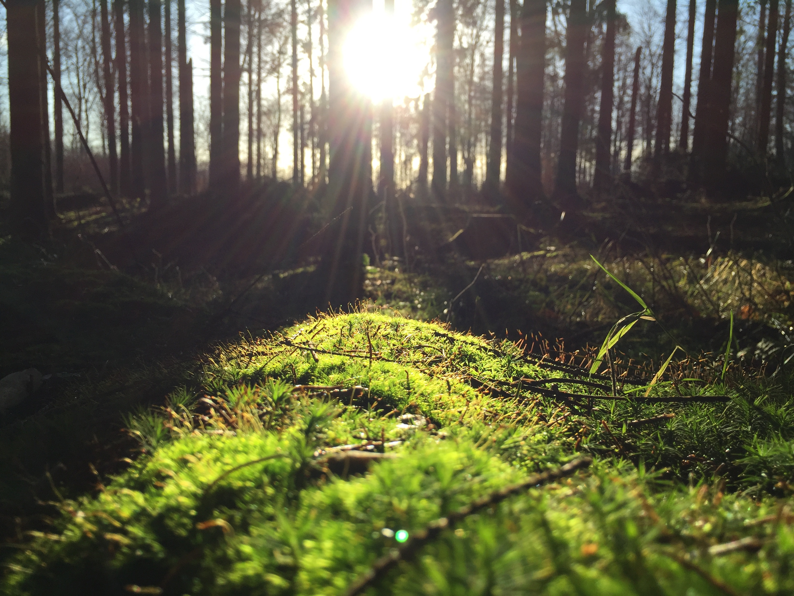
```

## Sunlight
- **The main source of light on th earth is the sun.** 
- Sunlight provides the energy that green plants use to create sugars mostly in the form of starches, which release energy into the living things that digest them. 
- This process of photosynthesis provides virtually all the energy used by living things. 

##
```{r sun-energy, fig.cap="Energy Pyramid", echo = FALSE, out.width = "90%", fig.align='center'}
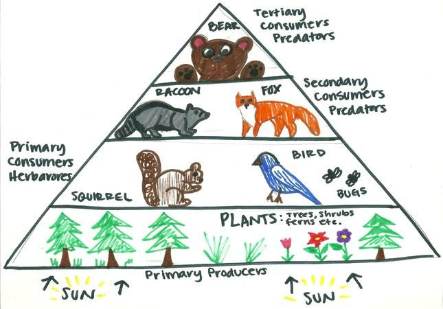
```


## 빛의 의미
- 일상적인 의미에서의 빛 = 가시광선
- 물리적인 의미에서의 빛 = 전자기파

##
```{r mirror, fig.cap="He found a new friend!", echo = FALSE, out.width = "60%", fig.align='center'}
knitr::include_graphics("extra/mirror.gif")
```


## 빛은 물질일까?
- 거울 속의 나는 내가 아니라 나의 빛
- **빛 = 에너지를 실어 나르는 파동**

##
```{r Light_dispersion_conceptual_waves, fig.cap="A triangular prism dispersing a beam of white light.", echo = FALSE, out.width = "80%", fig.align='center'}
knitr::include_graphics("extra/Light_dispersion_conceptual_waves.gif")
```


##
```{r sptr, fig.cap="A diagram of the electromagnetic spectrum.", echo = FALSE, out.width = "100%", fig.align='center'}
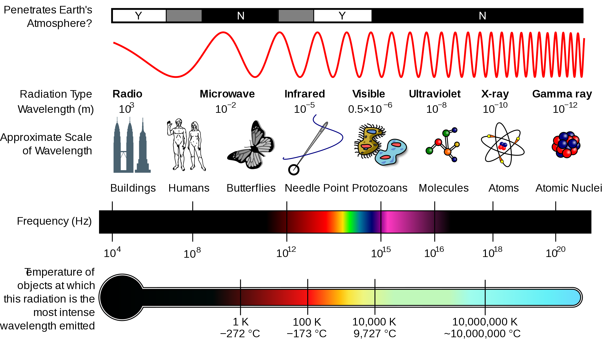
```

## Bioluminescence
- Some species of animals generate their own light, a process called bioluminescence. 
- Fireflies use light to locate mates, and vampire squids use it to hide themselves from prey.

##
<iframe width="420" height="240" src="https://www.youtube.com/embed/k72jGJTC_3o" frameborder="0" allow="accelerometer; autoplay; encrypted-media; gyroscope; picture-in-picture" allowfullscreen></iframe>

## 
<iframe width="420" height="240" src="https://www.youtube.com/embed/X8oWnbcLI40" frameborder="0" allow="accelerometer; autoplay; encrypted-media; gyroscope; picture-in-picture" allowfullscreen></iframe>

## Daylight
- Daylight is the combination of all direct and indirect sunlight during the daytime. 
- Daytime is the period of time each day when daylight occurs. 
- **Daylight happens as the earth rotates, and either side on which the sun shines is considered daylight.** 
- Illuminance is a measure of how much luminous flux is spread over a given area. 
- **The lux (symbol: lx) is the SI derived unit of illuminance.**

##

```{r lux-meter, fig.cap="Digital lux meter", echo = FALSE, out.width = "50%", fig.align='center'}
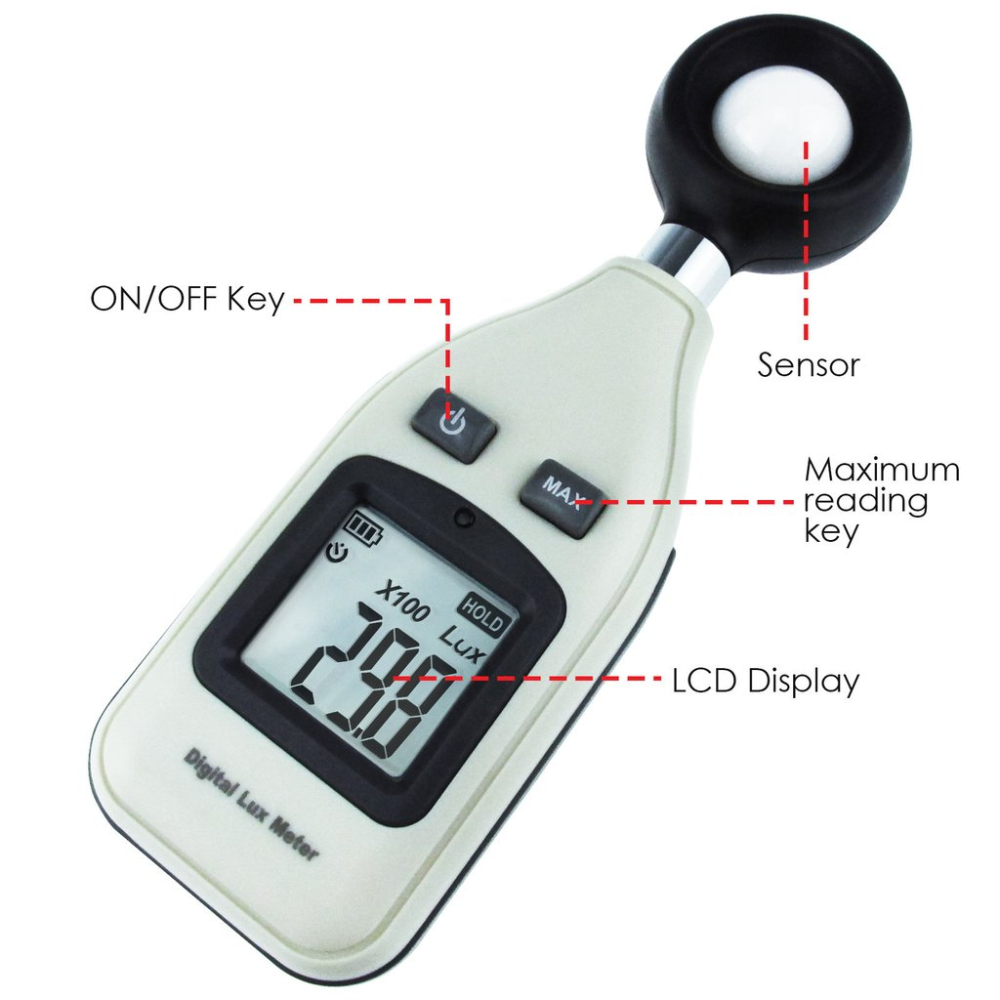
```


## 
```{r intensity, tab.cap="Light intensity in different conditions.", tidy=FALSE, echo=FALSE, message=FALSE, fig.align='center'}
library(magrittr)
tibble::tribble(
  ~"Illuminance", ~"Example",
  "120,000 lux", "Brightest sunlight",
  "111,000 lux", "Bright sunlight",
  "20,000 lux", "Shade illuminated by entire clear blue sky, midday",
  "1,000-2,000 lux", "Typical overcast day, midday",
  "400 lux", "Sunrise or sunset on a clear day",
  "0.25 lux", "A full Moon, clear night sky",
  "0.01 lux", "A quarter Moon, clear night sky"
) %>% knitr::kable(caption = "Light intensity in different conditions.", booktabs = TRUE)
```

# Photoperiodic response
## Photoperiodic response
- Photoperiodic response is the physiological reaction of organisms to the length of day or night. 
- A number of biological and behavioural changes are dependent on the daylength. 
- Together with temperature changes, photoperiod provokes changes in the color of fur and feathers, migration, entry into hibernation, sexual behaviour, and even the resizing of sexual organs.

##
```{r size, fig.cap="Male seasonal breeders resize their sexual organs.", echo = FALSE, out.width = "70%", fig.align='center'}
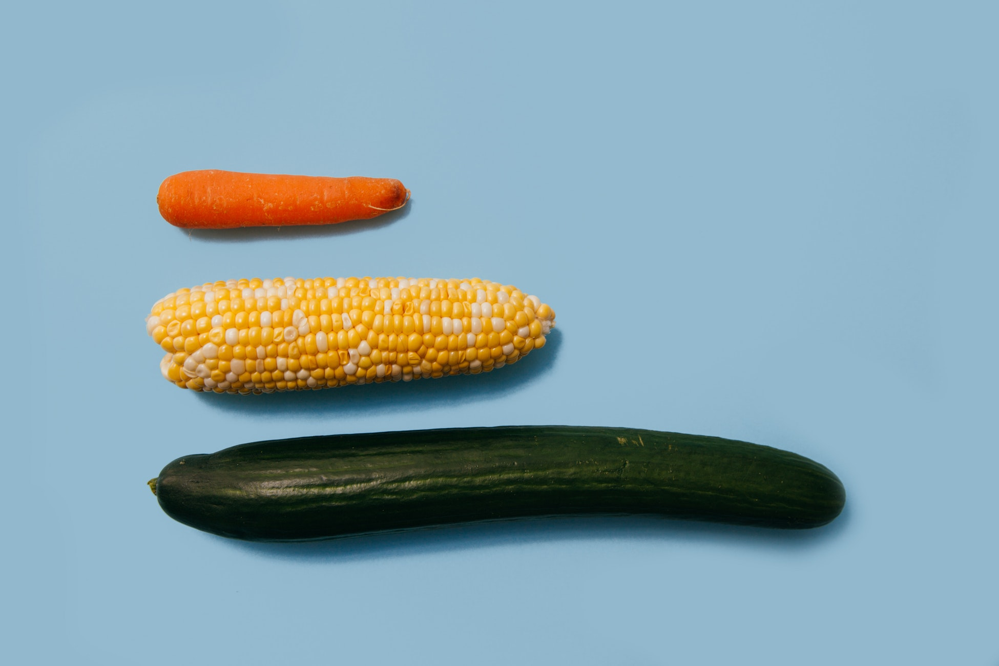
```

## 
- In animals, the regular activities of migration, reproduction, and the changing of coats or plumage can be induced out of season by artificially altering daylight. 
- Long periods of light followed by short periods will induce mating behaviour in species that normally breed in autumn (e.g. goats and sheep), while spring breeders (e.g. mink) will start the reproductive process when daylight is increased. 
- Application of photoperiodism is common in the poultry industry, as daylight affects egg-laying, mating, and body weight of the fowl.

# Seasonal breeding

##
```{r sheep, fig.cap="Sheep breeds when the length of daylight shortens", echo = FALSE, out.width = "65%", fig.align='center'}
knitr::include_graphics("figures/sheep.jpeg")
```

##
- Seasonal breeders are animal species that successfully mate only during certain times of the year. 
- **These times of year allow for the optimization of survival of young** due to factors such as ambient temperature, food and water availability, and changes in the predation behaviors of other species. 
- Related sexual interest and behaviors are expressed and accepted only during this period. 
- Female seasonal breeders will have one or more estrus cycles only when she is "in season" or fertile and receptive to mating. 
- Male seasonal breeders may exhibit changes in testosterone levels, testes weight, and fertility depending on the time of year.


## 
- The hypothalamus is considered to be the central control for reproduction due to its role in hormone regulation. 
- This is achieved specifically through changes in the production of the hormone GnRH. 
- GnRH in turn transits to the pituitary where it promotes the secretion of the gonadotropins LH and FSH, both pituitary hormones critical for reproductive function and behavior, into the bloodstream.

##
```{r seaonal-breed, fig.cap="Timing of annual reproductive cycle of exemplary seasonal breeders. PP, photoperiod. ", echo = FALSE, out.width = "70%", fig.align='center'}
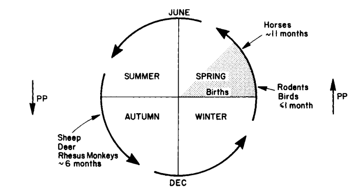
```

##
- Seasonal breeding readiness is strongly regulated by length of day (photoperiod) and thus season. 
- Photoperiod likely affects the seasonal breeder through changes in melatonin secretion by the pineal gland that ultimately alter GnRH release by the hypothalamus. 
- Seasonal breeders can be divided into groups based on fertility period. **"Long day"** breeders (horse, hamsters, and mink) cycle when days get longer (spring) and are in anestrus in fall and winter. 
- **"Short day"** breeders (sheep, goat, and elk) cycle when the length of daylight shortens (fall) and are in anestrus in spring and summer. 

# Effects on productivity
# Light control in poultry production
## Light control in poultry production
- Lighting is a key environmental factor in poultry production that is known to affect performance and behavior. 
- The photoperiod is the duration of the light period and scotoperiod is the duration of the dark period perceived in a light:dark cycle, which is typically 24 h in length. 

## Broiler
- Modern broiler stocks have been genetically selected for rapid growth, heavy BW, feed efficiency, and high breast meat yield. 
- The inactive nature of fully-fed broilers in combination with early attainment of heavy BW has contributed to developmental leg abnormalities. 
- Lighting programs have been developed based on their effectiveness in the industry to optimize performance. 
- The performance parameters of broilers in which producers are most interested are BW, feed efficiency, and livability. **Continuous lighting (24L:0D) leads to greater BW for meat-type chickens compared to those under 8L:16D or 12L:12D.** 
- Generally, **longer dark period leads to greater feed efficiency.**

##
```{r lightening, tab.cap="An example of broiler lighting program.", tidy=FALSE, echo=FALSE, message=FALSE, fig.align='center'}
library(magrittr)
tibble::tribble(
  ~"Days", ~"Light (h)", ~"Dark (h)", ~"Intensity (lux)",
  "0", 23, 1, 20,
  "1-2", 20, 4, 20,
  "3-4", 18, 6, 20,
  "5-14", 6, 18, 5,
  "15-21", 10, 14, 5,
  "22-28", 14, 10, 5,
  "29-35", 18, 6, 5,
  "36-42", 24, 0, 5
) %>% knitr::kable(caption = "An example of broiler lighting program.", booktabs = TRUE)
```

## Layers
- Layer hens require a minimum amount of light intensity for optimal egg production, usually 5 to 10 lux. 
- Both estrogen and progesterone are required to form eggs, and a short daylength will not stimulate the secretion of these hormones. 

##
```{r light-program-layers, fig.cap="Standar lighting program in layers", echo = FALSE, out.width = "85%", fig.align='center'}
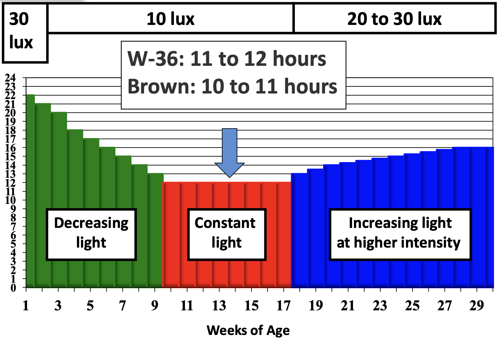
```

##
```{r crr, fig.cap="눈에 띄는 색 3가지를 고르고 순서를 기억해주세요.", echo = FALSE, out.width = "85%", fig.align='center'}
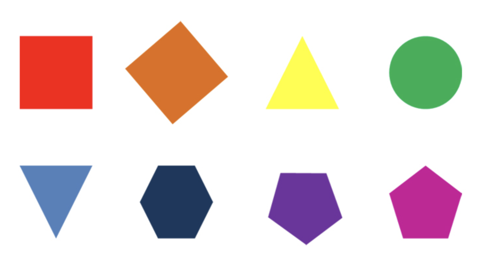
```

##
```{r crr1, fig.cap="개인의 본질", echo = FALSE, out.width = "75%", fig.align='center'}
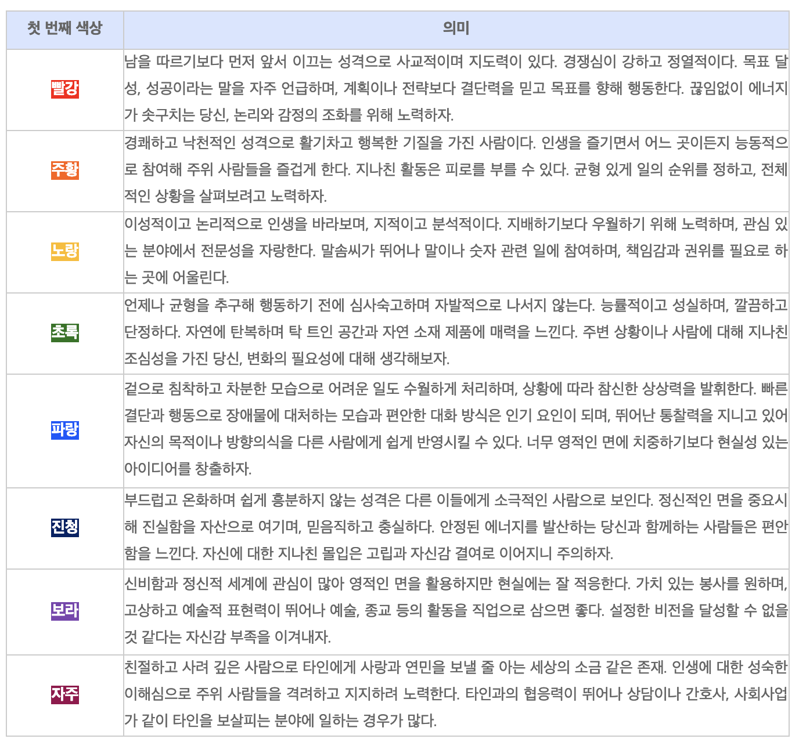
```

##
```{r crr2, fig.cap="현재 처해있는 상황", echo = FALSE, out.width = "95%", fig.align='center'}
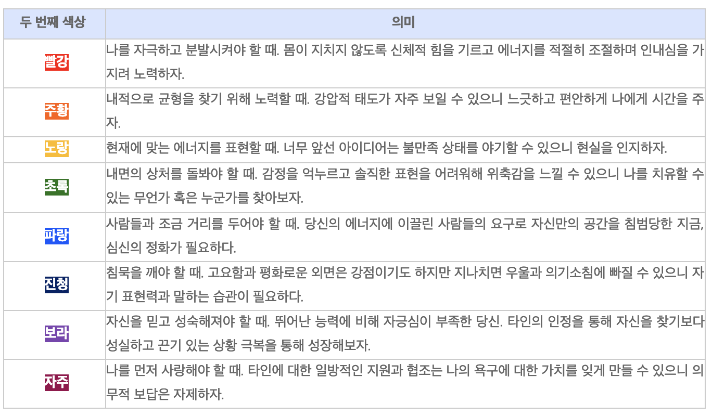
```

##
```{r crr3, fig.cap="내면적 비전", echo = FALSE, out.width = "95%", fig.align='center'}
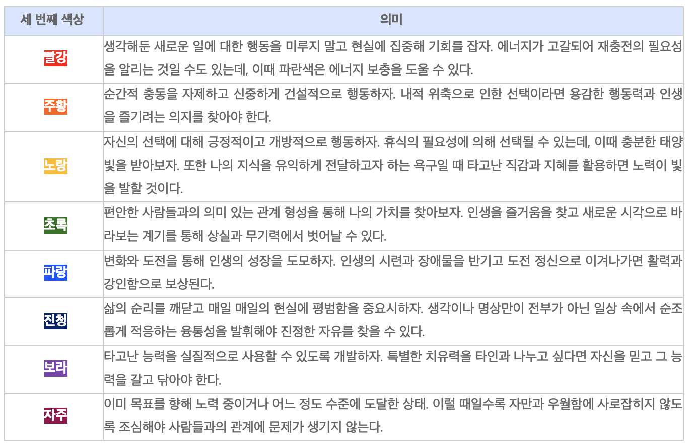
```

## Color of light
- **The color of light has been shown to affect the size and weight of the eggs.**  
- Blue-green light stimulates growth in chickens, whereas orange-red light stimulates reproduction. 
- Red light, in the 630nm wavelength range, was found to be superior to any other wavelength in increasing egg production.  
- However, blue light has a calming effect on birds whereas red may enhance feather pecking and cannibalism.

