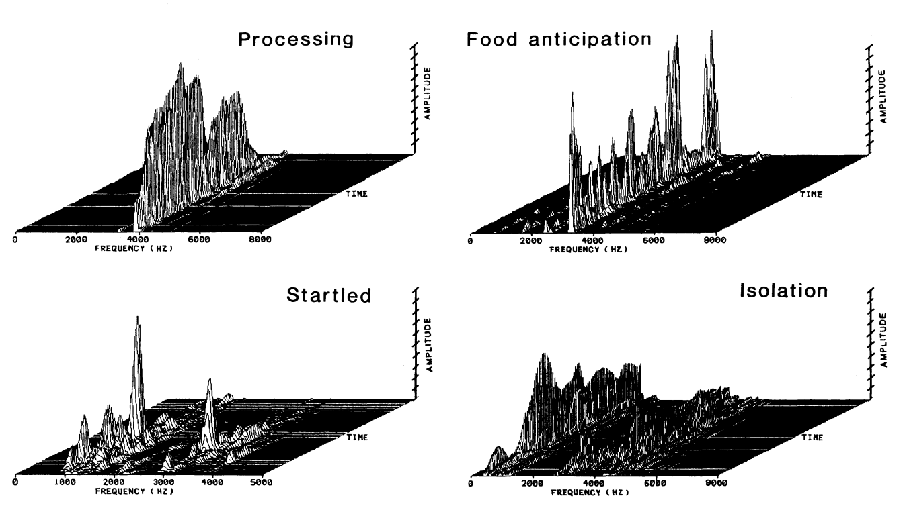
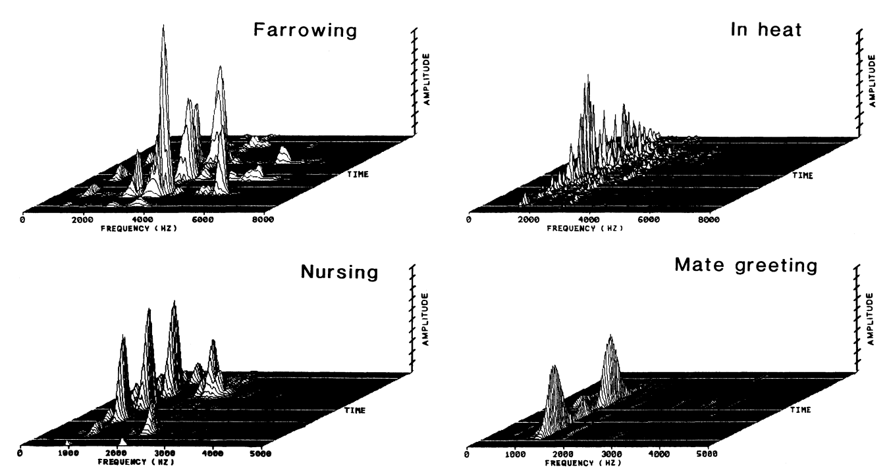

```{r setup, include=FALSE}
knitr::opts_chunk$set(echo = FALSE)
```


# Sound  
```{r soundwave, fig.cap="Sound is a vibration that typically propagates as an audible wave of pressure.", echo = FALSE,  out.width="100%", out.height="50%", fig.align='center'}

```

## 
> “One good thing about music, when it hits you, you feel no pain.” --- Bob Marley

<iframe width="550" height="386" src="https://www.youtube.com/embed/pHlSE9j5FGY" frameborder="0" allow="accelerometer; autoplay; encrypted-media; gyroscope; picture-in-picture" allowfullscreen></iframe>

##
- **Sound is a vibration that typically propagates as an audible wave of pressure, through a transmission medium such as a gas, liquid or solid.** 
- The sound waves are generated by a sound source, such as the vibrating diaphragm of a stereo speaker. 
- The sound source creates vibrations in the surrounding medium. 
- The speed of sound is the distance travelled per unit time by a sound wave as it propagates through an elastic medium. 
- At 20 °C, the speed of sound in air is about 343 m/s.

## Hertz and dicibel 
- The hertz (Hz) is the derived unit of frequency in the SI and is defined as one cycle per second. 
- A decibel (dB) measures ratios of power or intensity. The decibel is not an SI unit.


##  
```{r db, tab.cap="Examples of different level of decibel.", tidy=FALSE, echo=FALSE, message=FALSE}
library(magrittr)
tibble::tribble(
  ~"Sound Level",	~"Examples",
"150 dB",	"Right next to a jet engine",
"110-140 dB",	"Jet engine at 100 meters",
"130-140 dB",	"Where most people begin to feel pain",
"120 dB",	"Vuvuzela horn (1 meter in front of), risk of immediate hearing loss",
"80-90 dB",	"Traffic on a busy roadway",
"40-60 dB",	"Normal conversation",
"20-30 dB",	"Very calm room",
"0 dB",	"Hearing threshold right next to ear"
) %>% knitr::kable(caption = "Examples of different level of decibel.", booktabs = TRUE)
```


## Perception of sound
- The physical reception of sound in any hearing organism is limited to a range of frequencies. 
- Humans normally hear sound frequencies between approximately 20 Hz and 20,000 Hz (20 kHz). 
- The upper limit of sound frequency decreases with age.
- Dogs can perceive vibrations higher than 20 kHz. Ultrasound is sound waves with frequencies higher than 20,000 Hz. 
- Infrasound is sound waves with frequencies lower than 20 Hz. 
- Although sounds of such low frequency are too low for humans to hear, whales, elephants and other animals can detect infrasound and use it to communicate. 

## 
- **Sound is used by many species for detecting danger, navigation, predation, and communication.** 
- Earth's atmosphere, water, and virtually any physical phenomenon, such as fire, rain, wind, surf, or earthquake, produces its unique sounds.  
- Many species, such as frogs, birds, marine and terrestrial mammals, have also developed special organs to produce sound. 
- In some species, these produce song and speech. 
- Humans have developed culture and technology (such as music, telephone and radio) that allows them to generate, record, transmit, and broadcast sound.

##  
```{r coldplay, fig.cap="A band make the sound.", echo = FALSE, out.width = "100%", fig.align='center'}

```

## Vocalization

- Animal vocalization refers to any sound an animal may make to communicate a message to others. 
- All birds and mammals are able to vocalize. 
- They use the voice as communication signals to indicate some types of “need”. 

##  
<iframe width="640" height="360" src="https://www.youtube.com/embed/2Qa9YDgtcaM" frameborder="0" allow="accelerometer; autoplay; encrypted-media; gyroscope; picture-in-picture" allowfullscreen></iframe>

##  
- With increasing interest in measures of welfare “from the animal’s point of view” the study of vocalizations of the animal is still in the focus of interest. 
- The vocalization of pigs has been a topic of research since nearly half a century. 
- The vocalization in pigs is strongly related to their level of excitement. 
- Low-pitched vocalizations with low tonality such as grunts are used to maintain social contact with group mates. 
- Louder and longer but high-pitched calls such as screams are more related to the state of excitement. 

##  
```{r dog-trans, fig.cap="", echo = FALSE, out.width = "100%", fig.align='center'}

```
  
##
- Xin et al. (1989) demonstrated that in a production environment several types of pig vocalizations can be distinguished. 

```{r pig-vocalization1,  echo = FALSE, out.width = "100%", fig.align='center'}

```

##
```{r pig-vocalization, fig.cap="Sonographs of pig vocalizations (Xin et al., 1989).", echo = FALSE, out.width = "100%", fig.align='center'}

```


## Noise and animal stress

- Noise is described as unwanted sound, either chronic or intermittent, and can be described in terms including its frequency, intensity, frequency spectrum, and shape of sound pressure through time (Burn, 2008). 
- Decibel (dB) is the unit for measuring the intensity of sound. 

##  
- Noise in farm animal environments is a detrimental factor to animal health.
- Noise directly affects reproductive physiology or energy consumption. 
- **Unexpected high intensity noise** (above 110 dB), such as low altitude jet aircraft overflights at milking time could reduce the overall milk yield. 
- However, a majority of the studies reviewed suggests that there is little or no effect of aircraft noise on cattle. 
- Beyer (1983) found that helicopters caused worse reaction than other low-aircraft overflights.  

##
- Sounds produced by humans might also be stressful for farm animals. 
- Shouting on dairy cows appears to be very aversive (Pajor et al., 2000). 
- Noise made by humans shouting and slamming of metal gates increases heart rate and activity in cattle.

##
- Although farm animals and wildlife species exhibit adaptation after repeated exposure to noise, 
- **careful planning should be made before construction of the animal building**, in order to avoid stressful environmental sounds both for the animal and personnel.

## Music and animal welfare
- Humans derive both psychological and physiological benefits from listening to music, including reduced anxiety, pain relief and decreases in measures of stress such as blood pressure and heart rate. 
- Some nonhuman species may perceive music similarly to humans, but because of species differences in sensitivity to sound frequencies, music may be perceived differently by different species. 
- For example, most studies examining the physiological effects of music to date used rats, but most of the common laboratory rat's social communication occurs in the ultrasonic range. 


##  
- The type of music to which an animal is exposed is an important factor in determining whether the music will have any effect on the animal.
- Tempo, rhythm, pitch and tonality, may also influence the effects of music on the physiology of animals. 
- 'New age' music has been reported to have a 'calming' effect on mice in comparison to classical or pop music or the absence of music. 
- Raising chicks with music enrichment can decrease their stress levels. 
- Music has been used to manipulate physiology in order to improve milk production in dairy cattle and growth of poultry, swine, and fish. 
