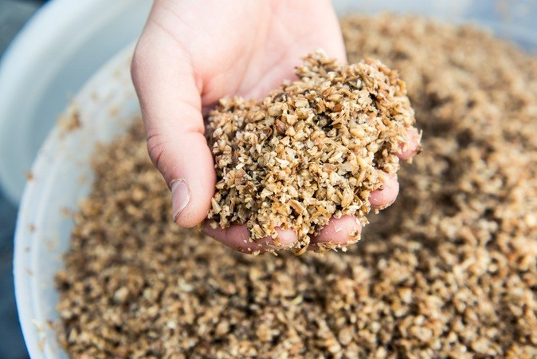
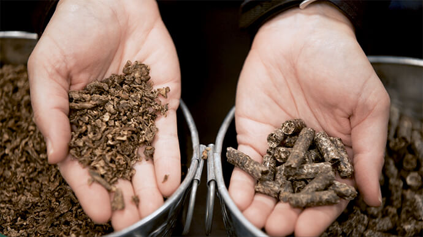
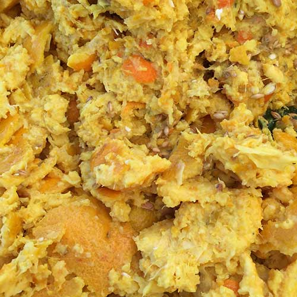
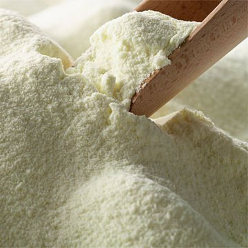
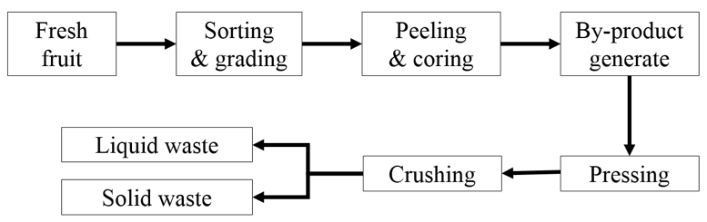

```{r setup, include=FALSE}
knitr::opts_chunk$set(echo = FALSE)
```

# Feed

##
```{r hay-feed, fig.cap="Proper feeding is key for a sustainable livestock industry.", echo = FALSE,  out.width="100%", fig.align='center'}
knitr::include_graphics("figures/hay-feed.jpeg")
```

##
- Feeding has a direct impact on the growth rate, production capacity and health status of the animal. 
- Proper feeding is key for a profitable and sustainable farming.

## Classification of feed materials

```{r feed-classification, fig.cap="Feed classification methodology (Mottet et al., 2017).", echo = FALSE,  out.width="100%", fig.align='center'}
knitr::include_graphics("figures/feed-classification.png")
```

# Agro by-product

##
```{r sbm, fig.cap="Soybean oil, meal and beans.", echo = FALSE,  out.width="100%", fig.align='center'}
knitr::include_graphics("figures/sbm.jpg")
```

##
- In modern livestock industry, high amount of grains and pulses are necessary to meet the requirement of high producing animal.
- However, these ingredients are in competition with humans (Knaus, 2013). 

##
- **An agricultural by-product is a secondary product generated during harvest or processing of grains, vegetables, and fruits.** 
- Although most by-products are human-inedible, they contain adequate organic materials which can be used by domestic animals. 
- For hundreds of years, the livestock industry has been typically used these agricultural by-products as a practical alternative feed ingredient. 

##
- **Using human-inedible by-products as feed ingredient could diminish the dependence on grains and pulses in livestock industry**. 
- In addition, if agricultural by-products are not disposed properly, it can cause the substantial environmental problems (Grasser et al., 1995). 
  
- [World mapping of animal feeding systems in the dairy sector](http://www.fao.org/3/a-i3913e.pdf)

# Some examples of by-products 

## Beer brewing waste
- Beer brewing waste is a by-product of the beer brewing industry, which ferments barley grains. 
- This is a foodstuff high in protein and cell wall, all of which has high digestibility.

```{r beer-brewing-waste, fig.cap="", echo = FALSE, out.width="60%", fig.align='center'}

```

## Beet pulp
```{r beet-pulp, fig.cap="", echo = FALSE, out.width="100%", fig.align='center'}

```

## Beet molasses or sugar cane molasses
- The by-products after extraction of sugars from the plants. 
- It contains high concentrations of minerals and proteins, mostly soluble proteins.

## How Cane Sugar Is Made
<iframe width="640" height="360" src="https://www.youtube.com/embed/EP_fgp7zYKk" frameborder="0" allow="accelerometer; autoplay; encrypted-media; gyroscope; picture-in-picture" allowfullscreen></iframe>


## Citrus peels
```{r citrus-pulp, fig.cap="", echo = FALSE, out.width="60%", fig.align='center'}

```

## Banana by-product
- In tropical regions, wastes from the banana growing industry are in widespread use, usually to feed mothers of meat calves and the calves themselves. 

## Whey and other milk processing wastes
- Whey has a high energy value and other milk processing wastes contain considerable levels of both fat and protein.

```{r whey, fig.cap="", echo = FALSE, out.width="40%", fig.align='center'}

```

## Poultry manure
- Poultry manure from broiler chicken is a good source of protein for beef cattle and calves. 
- In order to turn poultry manure into cattle feed, it must undergo a sterilization process to destroy pathogens. 
- https://www.feedipedia.org/node/66

## Pineapple by-product
- Up to 19.5% of pineapple by-product did not show any adverse effects on growth performance of beef cattle (Na, 2017).

```{r pcb-process, fig.cap="Pineapple canning process.", echo = FALSE, out.width="80%", fig.align='center'}

```

##
<iframe width="640" height="360" src="https://www.youtube.com/embed/xTA6PQtC2YA" frameborder="0" allow="accelerometer; autoplay; encrypted-media; gyroscope; picture-in-picture" allowfullscreen></iframe>

## Others
- Potatoes, carrots and other vegetables are good sources of available energy in the rumen, on condition that they are supplied fresh and without soil.

- Grape processing waste is a low value material, high in digestion depressant lignin and tannins. It can be used to cover silage pits, but it is not recommended as feed.

- Olive processing wastes, despite their lignin content, can be an efficient food because of their oil and protein content and as such they can be suitable as support for the straw fed to cattle living at maintenance level.

## High risk, high return
- The exploitation of high moisture by-products is problematic because of their **short storage life and the high moisture content**. 
- Although there are the high risk when using the by-products as the animal feed, using of the by-product is a very good chance that of improved profit margins along with a contribution to environmental.


