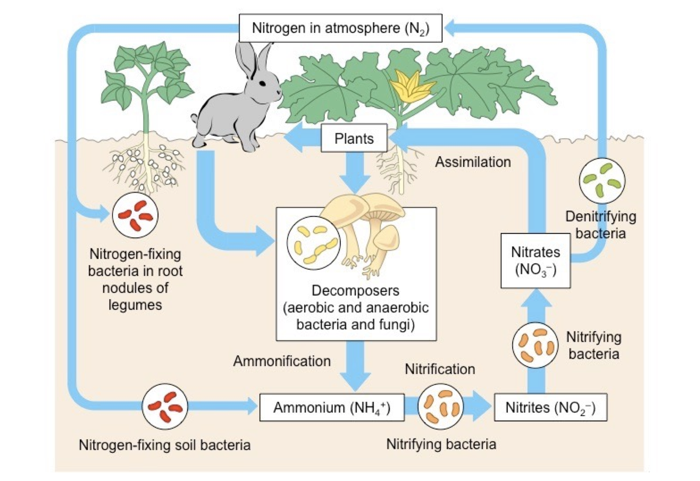
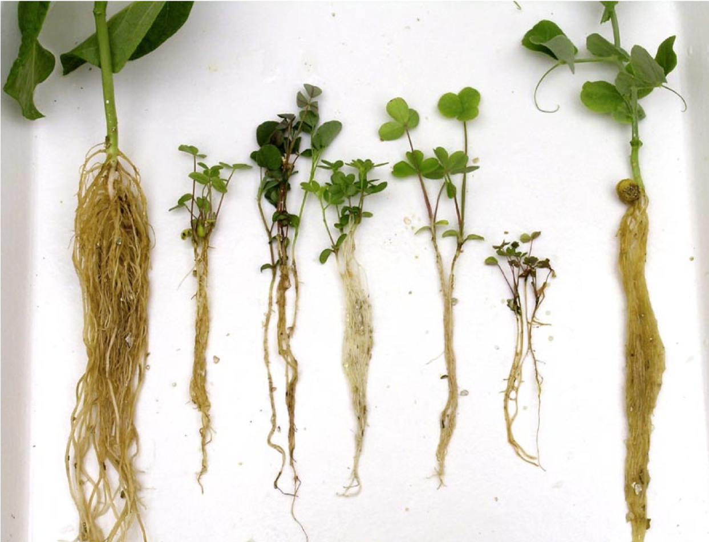
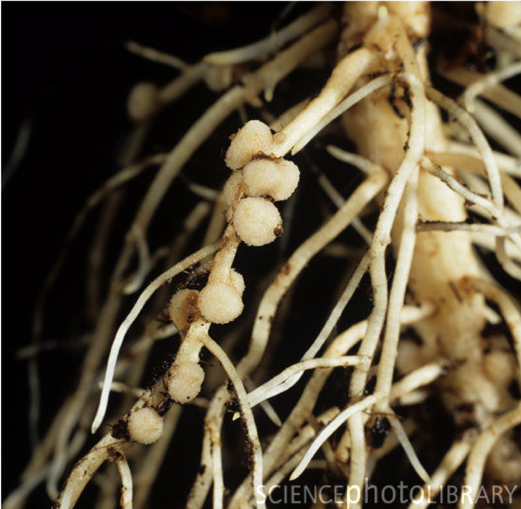
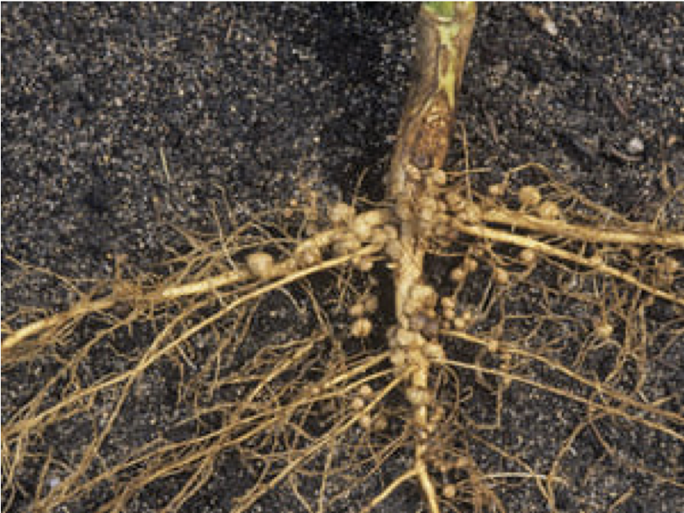

```{r setup, include=FALSE}
knitr::opts_chunk$set(echo = FALSE)
```

# Cycles of materials   

##
```{r oldman, fig.cap="All living things will return to Mother Nature.", echo = FALSE,  out.width="100%", fig.align='center'}

```

##
- **Materials are recycled while energy flows through ecosystems.**
- The atoms that make up animal's body already existed when the dinosaurs existed, and if you die they will be returned to the atmosphere and the soil to be taken up by other organisms.

# Trophic level
## Trophic level
- The trophic level of an organism is the position it occupies in a food chain. 
- A food chain is a succession of organisms that eat other organisms and may, in turn, be eaten themselves. 
- A food chain starts at trophic level 1 with primary producers such as plants, can move to herbivores at level 2, carnivores at level 3 or higher.
- The three basic ways in which organisms get food are as producers, consumers and decomposers.

## 1. Producers (autotrophs) 
- **Producers** (autotrophs) are typically plants or algae. 
- Plants and algae do not usually eat other organisms, but pull nutrients from the soil or the ocean and manufacture their own food using photosynthesis. 
- For this reason, they are called primary producers. 
- In this way, it is energy from the sun that usually powers the base of the food chain.


## 2. Consumers (heterotrophs) 
- **Consumers** (heterotrophs) are species that cannot manufacture their own food and need to consume other organisms. 
- Animals that eat primary producers (like plants) are called herbivores. 
- Animals that eat other animals are called carnivores, and animals that eat both plant and other animals are called omnivores.

## 3. Decomposers (detritivores) 
- **Decomposers** (detritivores) break down dead plant and animal material and wastes and release it again as energy and nutrients into the ecosystem for recycling. 
- Decomposers, such as bacteria and fungi (mushrooms), feed on waste and dead matter, converting it into inorganic chemicals that can be recycled as mineral nutrients for plants to use again.

# Water cycle
## Water cycle
- The water cycle describes the continuous movement of water on, above and below the surface of the Earth. 
- The water cycle involves the exchange of energy, which leads to temperature changes. When water evaporates, it takes up energy from its surroundings and cools the environment. 
- When it condenses, it releases energy and warms the environment. These heat exchanges influence climate.

# Carbon cycle
## 
```{r co2-atmosphere, fig.cap="Carbon dioxide in Earth's atmosphere if half of global-warming emissions are not absorbed (NASA).", echo = FALSE,  out.width="100%", fig.align='center'}

```

##
- Carbon is the basis of all organic molecules. 
- It makes up our genetic material (DNA and RNA) and proteins, which are essential for life. 
- Carbon is so special because of its ability to bond to almost any other molecule. 
- The major element within our bodies is carbon.

##
- The carbon cycle is the process through which carbon is cycled through the air, ground, plants, animals, and fossil fuels. 
- Large amounts of carbon exist in the atmosphere as carbon dioxide (CO2). 
- Carbon dioxide is cycled by green plants during the process known as photosynthesis to make organic molecules (glucose, which is food).

##
- Animals release carbon dioxide back into the air as a waste product from respiration. 
- Decomposers, when they break down dead organic matter, release carbon dioxide into the air also.
- Decomposers are essential because without them, all of the carbon on the planet would eventually become locked up in dead carcasses and other trash. 

##
- Carbon is also stored in fossil fuels, such as coal, petroleum, and natural gas. 
- When these are burned, carbon dioxide is also released back into the air. 
- Volcanoes and fires also release large amounts of CO2 into the atmosphere. 
- Carbon dioxide can dissolve in water, where some of it is later returned back into the atmosphere. 
- The rest can be taken to form calcium carbonate, which builds up shells, rocks, and skeletons of protozoans and coral.

# Nitrogen cycle

##
```{r clover, fig.cap="Rhizobia which symbiotically related with legumes is capable of fixing atmospheric nitrogen from the inorganic to the organic form.", echo = FALSE,  out.width="100%", fig.align='center'}

```

##
- Another important nutrient cycle is that of nitrogen. 
- Nitrogen is a critically important element for all life. 
- Proteins, which are constituents of all living cells, contain an average of 16% nitrogen by weight. 
- Other complex nitrogenous substances important to life are nucleic acids and amino sugars. 
- Without a continuous supply of nitrogen, life on earth would cease.

##
- Even though 79% of the earth atmosphere is composed of elemental nitrogen (N2), this inert gas is entirely unavailable for uptake by most plants and animals. 
- A relatively few microbes are capable of fixing atmospheric nitrogen from the inorganic to the organic form. 
- A number of bacteria, fungi, and blue-green algae are known to be able to fix nitrogen. 
- Nitrogen fixation involves the direct incorporation of atmospheric nitrogen into the organic body of the fixing organisms. 

## Nitrogen fixing organisms can be divided into:

1. Symbiotic nitrogen fixers, which are largely bacteria, and which are associated with roots of legumes.

2. Free living (nonsymbiotic) nitrogen fixers which includes the *Cyanobacteria*, *Anabaena*, and *Nostoc* and genera such as *Azotobacter, Beijerinckia,* and *Clostridium*.

## Nitrogen pool
- Nitrogen pool의 구성: 대기 pool, 토양 pool, 생물 pool
- 질소순환 (nitrogen cycle): 대기, 토양, 생물의 세가지 질소 pool  사이의 질소교환

1. 대기 pool:  대기중의 78%가 질소 , 생물학적, 산업적, 전기적 질소고정에 의해 질소 보충
2. 토양 pool : 질소순환의 중심식물과 미생물에 의해 질산이온(NO3-,  nitrate)로 생물체로 들어감
3. 생물 pool ; 식물의 광합성 작용에 의해 아미노산, 단백질 등의 유기질소로 전환, 동물이 식물 섭취, 먹이사슬에 따른 이동, 동물 배설물, 동물사체의 미생물 분해 – 토양으로 환원

##
```{r n-cycle, fig.cap="", echo = FALSE,  out.width="90%", fig.align='center'}

```

## 자연현상에 의한 고정(번개, 자외선, 복사에너지)
- 연간 총 질소고정량의 10% 
- 유리 활성원소(H, O)와 N2의 반응 :  N2   →  NO, N2O 로 전환

## 산업적 고정 
- 대기중의 산화질소 공급원: 산업적 연소, 산불, 자동차 배기가스
- 대기중의 산화질소 (NO, N2O 등)는 질산(HNO3)으로 쉽게 산화
- 빗방울에 의해 토양으로 되돌아 옴
- 산업적 고정(비료) : 연간 총 질소고정량의 15%가 고정됨

## 생물학적 고정 
- 살아있는 유기체에 의한 암모니아로의 환원
- 연간 총 질소고정량의 75%가 고정됨

##
```{r legume1, fig.cap="", echo = FALSE,  out.width="90%", fig.align='center'}

```

##
```{r legume2, fig.cap="", echo = FALSE,  out.width="50%", fig.align='center'}

```

##
```{r legume3, fig.cap="", echo = FALSE,  out.width="80%", fig.align='center'}

```


##
- Since bacterial cells die very rapidly, this nitrogen becomes available to the higher plants. 
- Crops of clover and beans actually add nitrogen to the soils in which they grown and eliminate the need for expensive fertilizers. 
- The symbiotic nitrogen fixers seem to be confined to terrestrial ecosystems and have not been found in aquatic habitats. 