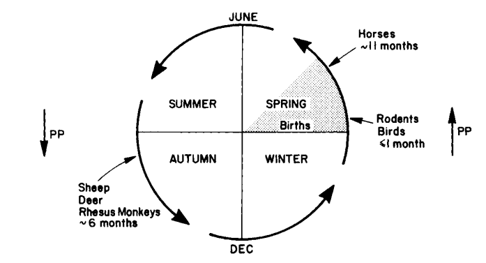
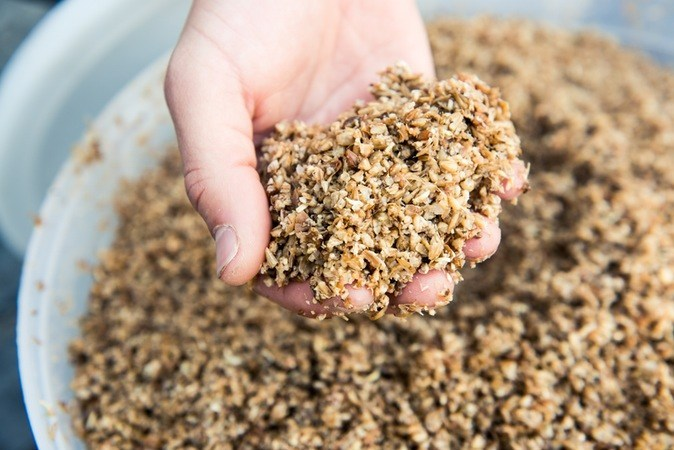
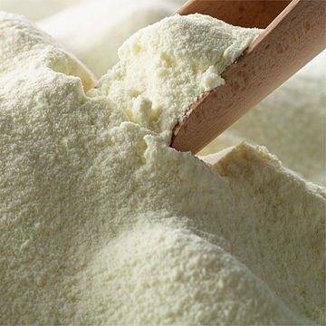

```{r setup, include=FALSE}
knitr::opts_chunk$set(echo = FALSE)
```

# Introduction

##
- All living creatures constantly interact with the environment. 
- To understanding individual animals, we have to understand the relationship they have with their environment. 
- Also, animals affect the environment. 
- From birth to death, an animal generates carbon dioxide, methane, feces, and urine. 
- The excretes from the animal are built with molecules such as carbon, nitrogen, sulfur, and phosphorus, and are recycled within and between ecosystems. 

# Animal and environment

##
```{r ext-int-env, fig.cap="External and internal environment", echo = FALSE, out.width = "60%", fig.align='center'}
knitr::include_graphics("figures/animal-env.png")
```

## External environment

- Animal never separates from the stimuli from outside. 
- Basically, animals can find food, shelter, protection, and mates from the environment called *habitat*. 
- The animal habitat includes both phisical (non-living) and biotic (livinig) components. 

## 

```{r habitat, tab.cap="", tidy=FALSE, echo=FALSE, message=FALSE, warning=FALSE}
library(tidyverse)
tibble::tribble(
  ~"No", ~Physical, ~Biotic,
  1,"Temperature", "Feed",
  2,"Humidity", "Individuals of the same species",
  3,"Light", "Parasites",
  4,"Water quality", "Competitors",
  5,"Air quality", ""
) %>%
  knitr::kable(caption = "Components of habitat (physical and biotic)", booktabs = TRUE)
```

## Internal environment
> "The living body, though it has need of the surrounding environment, is nevertheless relatively independent of it." --- Claude Bernard

- Higher animals have complex systems that respond to stimuli to perform their essential body functions. 
- Although external environments are continuously changed, if animals in the normal status, they keep the composition of the extracellular fluid (internal environment) constant to maintain their life. 
- We call it *homeostasis*. 

## 
```{r law-of-tol, fig.cap="Shelford's law of tolerance", echo=FALSE, message=FALSE, fig.width=6, fig.height=3, fig.align='center'}
library(ggplot2)
library(ggthemes)

ggplot(data.frame(x = c(-3, 3)), aes(x)) +
  stat_function(fun = dnorm, n = 101, args = list(mean = 0, sd = 1)) +
  scale_y_continuous(breaks = NULL) +
  scale_x_discrete(breaks = NULL) +
  ylab("Growth or Population") +
  xlab("Tolerance level") +
  theme_few()
```

## Adaptation
> "Changes in morphological, anatomical, physiological, biochemical and behavioral characteristics of the animal which promote welfare and favor survival in a specific environment." --- Hafez  

Hafez defined an adaptation as above. The adaptation helps an animal survive in their external environment. 
The representative adaptive traits are:

  1. Structural adaptation
  2. Behavioral adaptation
  3. Physiological adaptation

## Acclimatization

- Acclimatization is the physiological changes induced by a complex of factors such as altitude, temperature, humidity, photoperiod, or pH. 
- Acclimatization is the short-term process (hours to weeks) by comparison with adaptation (take place over many generations).  


# Temperature  

## Temperature  
- Temperature is a quantity expressing of the amount of heat. 
- Extremely high or low temperature results in loss of activity or lose the structure for most enzymes (*denaturation*).

##
```{r q10, fig.cap="The effects of temperature on enzyme activity [@q10]. Top - increasing temperature increases the rate of reaction (Q10 coefficient). Middle - the fraction of folded and functional enzyme decreases above its denaturation temperature. Bottom - consequently, an enzyme's optimal rate of reaction is at an intermediate temperature.", echo = FALSE, out.width = "60%", fig.align='center'}

knitr::include_graphics("figures/q10.png")
```

## 

```{r body-temp-comparision, echo=FALSE, message=FALSE, fig.width=6, fig.height=4.5, fig.align='center'}

library(tidyverse)

p <- tibble::tribble(
  ~"animal", ~"ambient", ~"body",
  "Snake", 3, 2.8,
  "Snake", 10, 10.1,
  "Snake", 20, 19.8,
  "Snake", 30, 30.8,
  "Snake", 35, 36.0,
  "Snake", 40, 39.0,
  "Bobcat", 3, 36.3,
  "Bobcat", 10, 36.5,
  "Bobcat", 20, 36.6,
  "Bobcat", 30, 37.0,
  "Bobcat", 35, 37.5,
  "Bobcat", 40, 37.5
) %>%
  ggplot(aes(ambient, body, color = animal)) +
  geom_point(size = 2) +
  geom_line() +
  xlab("Ambient temperature, °C") +
  ylab("Body temperature, °C") 

plotly::ggplotly(p)
```

## Poikilotherm

- The term derives from the acient Greek language *poikilos* (ποικίλος; changeable) and *thermos* (θερμός; heat).
- The body temperature of poikilotherms varies considerably than those of homeotherms. 

## Homeoterm

- Homeotherms can maintain body temperature independently from ambient temperatures by regulating the metabolic process. 
- They preserve their body temperature by muscle contraction and brown adipose tissue is catabolized for heat production. 
- In hot environments, they use evaporative cooling (sweating or panting) for maintaining their body temperature.
- Most of the domestic animals are homeotherm.

##
```{r e-system, fig.cap="Overview of feed energy flow through the animal body", echo = FALSE, out.width = "100%", fig.align='center'}

knitr::include_graphics("figures/energy-system.png")
```

## Thermoregulation
- **Thermoregulation** is a process to maintain the internal temperature within certain boundaries. 
- In homeotherms, thermoregulatory physiology is mainly controlled by nervous and endocrine systems. 
- In poikilotherms, they use external sources of temperature to keep their body temperatures. 
- There are some methods for thermoregulation in poikilotherms: *convection*, *conduction*, and *radiation*. 

## Thermoregulation
- **Convection** is the transfer of heat via the movement of molecules within fluids (gases or liquids). 
- **Conduction** is the transfer of heat via the direct molecular collision. 
- **Radiation** is the transfer of heat in the form of waves or particles (sunlight is the most familiar forms of radiation). 

##
```{r lizard, fig.cap="", echo = FALSE, out.width = "70%", fig.align='center'}


```

## Temperature humidity index (THI)  

- Temperature–humidity index (THI) is a **combination of temperature and humidity** that is a measure of the degree of discomfort experienced by an individual in warm weather (a.k.a. discomfort index). 


##  
- Temperature-humidity index for dairy cow is calculated as 

$THI = (0.8*T) + [H*(T - 14.4)] + 46.4$

where T is the air temperature and H is the relative humidity. 

- The THI is a useful tool for predicting the heat stress of cows, however, it does not account for solar radiation and wind speed which can affect the heat load of cattle.

## 
```{r THI, fig.cap="THI chart for dairy cows.", echo = FALSE, out.width = "50%", fig.align='center'}

knitr::include_graphics("figures/THI.png")
```

## Heat stress
- **Heat stress decreases the animal production and welfare.**
- Heat stress decreases reproductivity
- **In general, high performance animal produces more body heat due to their fast metabolism.**

## Heat stress management (in cattle)
1. Fan installations
2. Sprinklers
3. Consumption of water
4. Changing the diet (reduce the energy)

## Heat stress management (in swine)
- Increase ventilation and airflow.
- Reduce stocking density.
- Maintain drinking water temperature as low as possible.
- Avoid feeding between 10:00 to 16:00 (the hottest period of the day).

## Heat stress management (in poultry)
- Ventilation.
- Maintain drinking water temperature as low as possible.
- A shiny surface reflects solar radiation more than a dark or rusty roof.
- Fat addition and excess essential amino acids in feed.
- Supplement of minerals (Fe, Zn, Se and Cr) and vitamins (vitamin A, C and E).

# Light

## Sunlight
- **The main source of light on th earth is the sun.** 
- Sunlight provides the energy that green plants use to create sugars mostly in the form of starches, which release energy into the living things that digest them. 
- This process of photosynthesis provides virtually all the energy used by living things. 

## Photoperiodic response
- Photoperiodic response is the physiological reaction of organisms to the length of day or night. 
- A number of biological and behavioural changes are dependent on the daylength. 
- Together with temperature changes, photoperiod provokes changes in the color of fur and feathers, migration, entry into hibernation, sexual behaviour, and even the resizing of sexual organs.
- In animals, the regular activities of migration, reproduction, and the changing of coats or plumage can be induced out of season by artificially altering daylight. 

## Seasonal breeding
- Seasonal breeders are animal species that successfully mate only during certain times of the year. 
- **These times of year allow for the optimization of survival of young** due to factors such as ambient temperature, food and water availability, and changes in the predation behaviors of other species. 
- Seasonal breeders can be divided into groups based on fertility period. **"Long day"** breeders (horse, hamsters, and mink) cycle when days get longer (spring) and are in anestrus in fall and winter. 
- **"Short day"** breeders (sheep, goat, and elk) cycle when the length of daylight shortens (fall) and are in anestrus in spring and summer. 

##
```{r seaonal-breed, fig.cap="Timing of annual reproductive cycle of exemplary seasonal breeders. PP, photoperiod. ", echo = FALSE, out.width = "70%", fig.align='center'}

```

## Antlers
- **Antlers are shed and regrown each year** (grown every spring and shed every winter) and function primarily as objects of sexual attraction and as weapons in fights between males.
- **The annual antler cycle is ultimately controlled by day length or photoperiod.** 

##
```{r antler-stage, fig.cap="Stages of antler growth. (Photo Credits A-E, Steve Demarais, F, Dave Hewitt)", echo = FALSE, out.width = "70%", fig.align='center'}

```

## Light control in poultry production
- Lighting is a key environmental factor in poultry production that is known to affect performance and behavior. 
- The performance parameters of broilers in which producers are most interested are BW, feed efficiency, and livability. **Continuous lighting (24L:0D) leads to greater BW for meat-type chickens compared to those under 8L:16D or 12L:12D.** 
- Generally, **longer dark period leads to greater feed efficiency.**

##
```{r lightening, tab.cap="An example of broiler lighting program.", tidy=FALSE, echo=FALSE, message=FALSE, fig.align='center'}
library(magrittr)
tibble::tribble(
  ~"Days", ~"Light (h)", ~"Dark (h)", ~"Intensity (lux)",
  "0", 23, 1, 20,
  "1-2", 20, 4, 20,
  "3-4", 18, 6, 20,
  "5-14", 6, 18, 5,
  "15-21", 10, 14, 5,
  "22-28", 14, 10, 5,
  "29-35", 18, 6, 5,
  "36-42", 24, 0, 5
) %>% knitr::kable(caption = "An example of broiler lighting program.", booktabs = TRUE)
```

##
```{r light-program-layers, fig.cap="Standar lighting program in layers", echo = FALSE, out.width = "85%", fig.align='center'}
knitr::include_graphics("extra/light-program-layers.png")
```

## Color of light in poultry production
- **The color of light has been shown to affect the size and weight of the eggs.**  
- Blue-green light stimulates growth in chickens, whereas orange-red light stimulates reproduction. 
- Red light, in the 630nm wavelength range, was found to be superior to any other wavelength in increasing egg production.  
- However, blue light has a calming effect on birds whereas red may enhance feather pecking and cannibalism.

# Sound  
```{r soundwave, fig.cap="Sound is a vibration that typically propagates as an audible wave of pressure.", echo = FALSE,  out.width="100%", out.height="50%", fig.align='center'}

```

## Vocalization

- Animal vocalization refers to any sound an animal may make to communicate a message to others. 
- All birds and mammals are able to vocalize. 
- They use the voice as communication signals to indicate some types of “need”. 

##
```{r pig-vocalization, fig.cap="Sonographs of pig vocalizations (Xin et al., 1989).", echo = FALSE, out.width = "100%", fig.align='center'}
knitr::include_graphics("figures/pig-vocal2.png")
```

## Noise and animal stress

- Noise is described as **unwanted sound**, either chronic or intermittent, and can be described in terms including its frequency, intensity, frequency spectrum, and shape of sound pressure through time (Burn, 2008). 
- **Unexpected high intensity noise** (above 110 dB), such as low altitude jet aircraft overflights at milking time could reduce the overall milk yield. 
- However, a majority of the studies reviewed suggests that there is little or no effect of aircraft noise on cattle. 

## Music and animal welfare
- The type of music to which an animal is exposed is an important factor in determining whether the music will have any effect on the animal.
- Tempo, rhythm, pitch and tonality, may also influence the effects of music on the physiology of animals. 
- Music has been used to manipulate physiology in order to improve milk production in dairy cattle and growth of poultry, swine, and fish. 


# Air quality
##
- **Air quality is the degree of pollution of air.** 
- Air quality has a direct influence on health, welfare and production performance of livestock. 

## Importance of air quality
- Animals that continually exposed to bad air quality had **reduced productivity and increased the stress. **
- Maintaining good air quality is not only important for the productivity of the animals, but also for the **welfare of the animals.** 

## Ammonia  

- Ammonia (NH3) is an important pollutant gas. 
- Livestock wastes account for 39% of global emissions. 
- Among them, pig production is globally responsible for about 15% of NH3 emissions associated to livestock. 

##
```{r ammonia-manure, fig.cap="Repartition of sources of global ammonia emissions (Galloway et al., 2004).", echo = FALSE,  out.width="50%", fig.align='center'}
knitr::include_graphics("figures/ammonia-manure.jpg")
```

## Nitrogen transformations and ammonia production in manure

```{r ammonia-trans, fig.cap="Nitrogen (N) transformation in livestock manure and releases to the atmosphere (NH3, ammonia; NH4+, ammonium; NO3−, nitrate; N2O, nitrous oxide; N2, dinitrogen; g, gaseous form; l, liquid form) (adapted from Philippe et al., 2011).", echo = FALSE,  out.width="50%", fig.align='center'}
knitr::include_graphics("figures/ammonia-trans.jpg")
```

## Suppression methods
1. Decreasing of the length of the time manure remained.
2. Keeping buildings and the animals clean and dry.
3. Separation manure from urine.
4. Using acidifying agents to suppress ammonia emissions from manure.
5. Filtration.  
6. Landscaping: Trees, shrubs and other vegetative barriers planted around livestock buildings have the potential of reducing ammonia emissions.

## Dietary strategies
1. Reduced crude protein (CP) diets containing synthetic amino acids have been shown to reduce N excretion, which leads to reduce NH3 emissions.
2. Reducing NH3 emissions from the slurry can also be achieved by the addition of fibrous feedstuffs in the diet. 
3. Feed additives: Non-starch polysaccharides enzymes, yucca extract, zeolites, probiotics, and so on.


# Water quality
```{r water-pig, fig.cap="All living things, from tiny bacteria to giant blue whales, need water to survive.", echo = FALSE,  out.width="80%", fig.align='center'}
knitr::include_graphics("figures/water-pig.jpeg")
```

##
- Measurements of water quality and quantity are required for effective planning and monitoring of water supplies for livestock. 
- **If water quality is poor, livestock may drink less than they need or, rarely, may stop drinking.** 
- When animals drink less, they will eat less and lose condition and if they are lactating, their milk production will reduce. 
- Failure to provide proper and sufficient water for livestock not only affects production, it may be an animal welfare offence.

## Microbiological contaminants
```{r cyanobacteria, fig.cap="Natural toxins originating from cyanobacteria are a primary concern in drinking water for livestock.", echo = FALSE,  out.width="100%", out.height="100%", fig.align='center'}
knitr::include_graphics("figures/cyanobacteria.jpg")
```

## Cyanobacteria
- Natural toxins originating from cyanobacteria (blue-green algae) are a primary concern in drinking water for livestock. 
- Cyanobacteria are known to produce acute hepatotoxins, cytotoxins, neurotoxins, and toxins causing the gastrointestinal diseases. 
- However, **heavy cyanobacteria growth does not necessarily mean high levels of toxin.** The trigger for cyanobacteria to produce toxins is not completely understood. 

## Pathogens 
- A variety of microbial pathogens can be transmitted to livestock from drinking water sources contaminated. 
- The pathogens of greatest concern in water supplies for farm animals include enteric bacteria such as *E. coli*, *Salmonella* and *Campylobacter jejuni*. 
- **The cause of biological contamination of water sources is associated with the animal industry itself**. 

## Water treatment technologies
- Water contaminants can be decreased considerably or even completely eliminated by a variety of treatment methods. 
- Some methods are more effective than others, but for treating water for livestock consumption, economics are an important issue. 

## 1. Activated carbon filters
- **This method is based on passing water through a filter containing activated carbon granules.** 
- Contaminants attach to the granules and are removed. 
- The filters must be inspected and replaced frequently. 
- Poor filter maintenance will decrease effectiveness, and may result in bacterial growth on the filter, causing potential contamination of the water with pathogens. 

## 2. Air stripping

- **Air stripping is the transferring of volatile components of a liquid into an air stream.** 
- It is an environmental engineering technology used for the purification of groundwaters and wastewaters containing volatile compounds. 
- Contaminants are transferred from water to air and vented off. This method may be effective in removing hydrogen sulphide, some odours and tastes, and some volatile organic chemicals.

##
```{r Air-Stripper, fig.cap="Air-Stripper diagram (Monroe Environmental Corp., 2019).", echo = FALSE,  out.width="35%", fig.align='center'}
knitr::include_graphics("figures/Air-Stripper.png")
```

## 3. Biological filters
- Biological filtration is a natural process that takes place in rivers, streams, and oceans. 
- Bacteria eat certain compounds, like ammonia, which is broken down into byproducts that are not toxic.  
- This method is effective at removing iron, arsenic, and organics. 
- A microbiological layer is used to filter and consume contaminants.

## 4. Chlorination
- This is one of **the most common methods in water treatment** for pathogen reduction in drinking water for livestock. 
- Chlorination is much more effective if it follows a filtration system to remove large particles that can house bacteria. 
- In particular, this is an effective and widely used method to kill many kinds of microorganisms in water. 
- Chlorine content of the treated water should be monitored because the high concentrations of chlorine released to the animal water system may affect water intake and productivity.

## 5. Ozonation  
- This method of water treatment is based on application of ozone gas. 
- Ozone is a very potent oxidizing agent, and destroys pathogenic microorganisms. 
- It can reduce color, improves taste, odor, kills bacteria, viruses, oxidize iron, manganese, cyanide, phenol, benzene, chlorophenol, atrazine, nitrobenzene and other pollutants. 
- The equipment typically is quite expensive.  


# Feed
```{r hay-feed, fig.cap="Proper feeding is key for a sustainable livestock industry.", echo = FALSE,  out.width="100%", fig.align='center'}
knitr::include_graphics("figures/hay-feed.jpeg")
```

##
- Feeding has a direct impact on the growth rate, production capacity and health status of the animal. 
- Proper feeding is key for a profitable and sustainable farming.

## Agro by-product
- **An agricultural by-product is a secondary product generated during harvest or processing of grains, vegetables, and fruits.** 
- Although most by-products are human-inedible, they contain adequate organic materials which can be used by domestic animals. 
- For hundreds of years, the livestock industry has been typically used these agricultural by-products as a practical alternative feed ingredient. 

##
- **Using human-inedible by-products as feed ingredient could diminish the dependence on grains and pulses in livestock industry**. 
- In addition, if agricultural by-products are not disposed properly, it can cause the substantial environmental problems (Grasser et al., 1995). 

## Beer brewing waste
- Beer brewing waste is a by-product of the beer brewing industry, which ferments barley grains. 
- This is a foodstuff high in protein and cell wall, all of which has high digestibility.

```{r beer-brewing-waste, fig.cap="", echo = FALSE, out.width="60%", fig.align='center'}

```

## Beet pulp
```{r beet-pulp, fig.cap="", echo = FALSE, out.width="100%", fig.align='center'}
knitr::include_graphics("extra/beet-pulp.jpg")
```

## Beet molasses or sugar cane molasses
- The by-products after extraction of sugars from the plants. 
- It contains high concentrations of minerals and proteins, mostly soluble proteins.

## Citrus peels
```{r citrus-pulp, fig.cap="", echo = FALSE, out.width="60%", fig.align='center'}
knitr::include_graphics("extra/citrus-pulp.jpg")
```

## Banana by-product
- In tropical regions, wastes from the banana growing industry are in widespread use, usually to feed mothers of meat calves and the calves themselves. 

## Whey and other milk processing wastes
- Whey has a high energy value and other milk processing wastes contain considerable levels of both fat and protein.

```{r whey, fig.cap="", echo = FALSE, out.width="40%", fig.align='center'}

```

## Poultry manure
- Poultry manure from broiler chicken is a good source of protein for beef cattle and calves. 
- In order to turn poultry manure into cattle feed, it must undergo a sterilization process to destroy pathogens. 
- https://www.feedipedia.org/node/66

## Pineapple by-product
- Up to 19.5% of pineapple by-product did not show any adverse effects on growth performance of beef cattle (Na, 2017).

```{r pcb-process, fig.cap="Pineapple canning process.", echo = FALSE, out.width="80%", fig.align='center'}
knitr::include_graphics("extra/pcb-process.png")
```

# Exogenous enzyme

## Why a balanced diet is the best?
```{r e-system1, fig.cap="Overview of feed energy flow through the animal body", echo = FALSE, out.width = "100%", fig.align='center'}

knitr::include_graphics("figures/energy-system.png")
```

## Phosphorous
- Phosphorous is normally present in surface water at a rate of only 0.02 parts per million.
- Introducing additional phosphorous in water results in a massive growth of algae, which are aquatic plants including many single-celled, free-floating plants. 
- Excessive amounts of algae cloud the water in an effect called an algal bloom, which reduces the sunlight available to other plants and sometimes kills them. 

##
```{r ku-ilgam, fig.cap="", echo = FALSE,  out.width="45%", fig.align='center'}

```

## Phytate
- Phosphorus is an essential nutrient for animals. 
- It is required for bone growth, cell structure, and enzymatic processes. 
- However, meeting phosphorus requirements for growing pigs is difficult because **approximately 60 % to 70 % of phosphorus in plant-based swine feed ingredients occurs as phytate phosphorus.** 

##
- Phytates are complex molecules that bind phosphorus and other nutrients for storage in seeds and grains. 
- Phytate is considered an antinutritional factor for swine because it reduces digestibility of phosphorus, energy, and other nutrients in pigs. 
- Therefore, the degradation of phytate in the upper part of the digestive tract is essential to improve phosphorus availability and eliminate the antinutritional effects of phytate.

##
```{r phytate, fig.cap="Structure of phytate (myo-inositol, 1,2,3,4,5,6-hexakisphosphate (IP6, IUPAC).", echo = FALSE,  out.width="40%", fig.align='center'}
knitr::include_graphics("figures/phytate.jpg")
```

## Phytase
- Monogastric animals lack sufficient intestinal phytase, which is the enzyme required to break down phytate molecules and release bound phosphorus. 
- Several studies have shown that supplementing swine diets with the phytase from various sources improves phytate phosphorus utilization. 
- **Adding phytase can reduce the antinutritional effect of phytate and improve the digestibility of phosphorous (P), calcium, amino acids and energy, as well as reduce the negative impact of inorganic P excretion to the environment.** 
